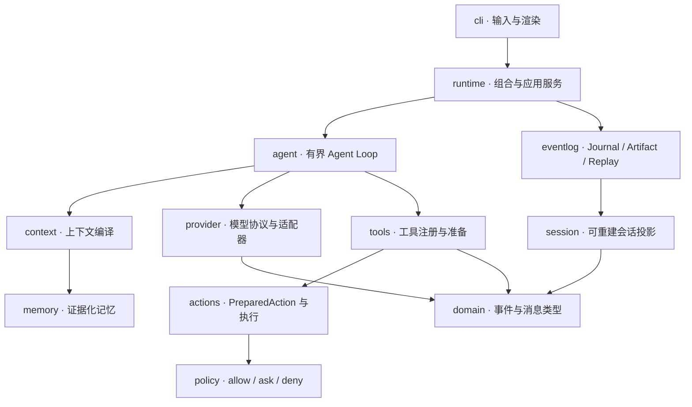
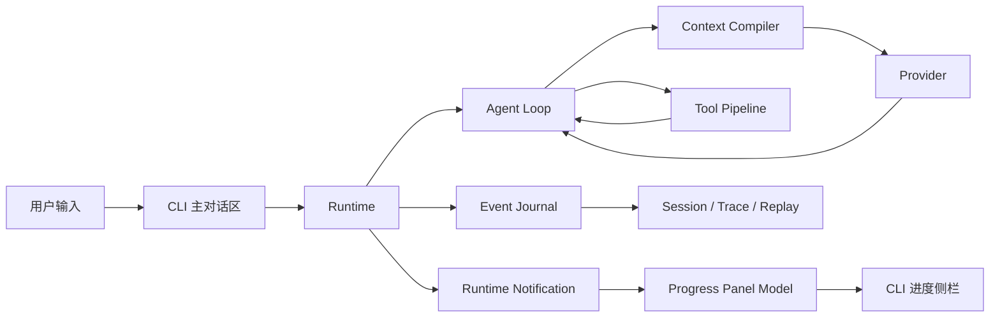

# MicroCode 项目架构说明

> 本文档由 `scripts/update_infrastructure.py` 自动生成，请勿直接编辑。
>
> 项目清单指纹：`2e232dc348a145d5`
>
> 更新命令：`python scripts/update_infrastructure.py`

## 1. 文档目的

本文档描述 MicroCode 当前项目分层、文件树、每个文件的职责和文档自动更新机制。它反映的是当前工作区实际状态；产品目标见 `doc/prd.md`，逐步实现教程见 `doc/plan.md`。

“架构骨架”表示文件和接口已经建立，但仍包含明确的 `NotImplementedError`；“基础实现”表示已经有可执行逻辑，但不等于对应 MVP 里程碑已经验收完成。

## 2. 架构原则

1. Event Log 是会话、审批、工具结果和记忆的唯一事实源。
2. CLI 只负责输入输出，不持有业务状态。
3. Agent Loop 只编排上下文、Provider 和工具流水线。
4. 副作用统一经过 `validate → prepare → policy → approval → execute → record`。
5. Projection 和 Snapshot 可以重建，Replay 不调用模型、不执行工具。
6. Python 模块的首行 docstring 是本文件职责说明的默认来源。

## 3. 分层与依赖



依赖方向应由外层适配器指向内层协议和领域模型。`domain` 不得引用 CLI、厂商 SDK 或具体存储实现；Replay 不得依赖 Provider 和 Tool Executor。

### 3.1 运行时数据流



Event Journal 保存可重建的业务事实；Runtime Notification 用于即时渲染，Progress Panel Model 只投影当前 Turn 的轻量阶段状态。两条路径都不允许由 CLI 反向修改领域状态。

## 4. 当前文件架构

每个文件名后直接列出简要职责；更完整的职责与实现状态见第 5 节。

```text
MicroCode/
├── .githooks/
│   └── pre-commit — 提交前自动重建并暂存项目架构文档
├── doc/
│   ├── infrastructure.md — 当前文件；由脚本生成的项目架构、文件清单和维护规则
│   ├── plan.md — 从 M0 到 M12 的 MVP 逐步实现教程
│   ├── prd.md — 定义产品目标、MVP 边界、核心创新和验收标准
│   └── 进度.md — 文档：2026-08-12 完成 M1 领域类型与事件模型
├── scripts/
│   ├── install_git_hooks.py — 为当前 Git 仓库启用已提交的 .githooks 目录
│   └── update_infrastructure.py — 扫描项目并确定性生成本架构文档
├── src/
│   ├── microcode/
│   │   ├── actions/
│   │   │   ├── __init__.py — Prepared effects, previews, and execution adapters
│   │   │   ├── diff.py — Unified diff generation using the Python standard library
│   │   │   ├── executor.py — Side-effect executor boundary
│   │   │   └── models.py — Serializable actions prepared before policy and approval
│   │   ├── agent/
│   │   │   ├── __init__.py — Bounded agent loop and prompt construction
│   │   │   ├── loop.py — Bounded agent turn orchestration
│   │   │   └── prompts.py — Small, explicit system instruction builders
│   │   ├── cli/
│   │   │   ├── __init__.py — Thin command-line input and rendering adapters
│   │   │   ├── app.py — Prompt-toolkit REPL and application command routing
│   │   │   ├── commands.py — Slash-command parsing independent from the interactive REPL
│   │   │   └── renderer.py — Rich-based rendering adapter boundary
│   │   ├── context/
│   │   │   ├── __init__.py — Explainable context collection, scoring, selection, and rendering
│   │   │   ├── compiler.py — Context compiler orchestration
│   │   │   ├── models.py — Immutable context compiler inputs and outputs
│   │   │   ├── scoring.py — Deterministic and explainable context scoring
│   │   │   └── sources.py — Context source contracts and built-in source boundaries
│   │   ├── domain/
│   │   │   ├── __init__.py — Provider-independent domain types
│   │   │   ├── events.py — Versioned event envelopes, payload schemas, and event construction
│   │   │   ├── json_types.py — Recursive JSON types and strict validation for durable schemas
│   │   │   └── messages.py — Portable message and content block models
│   │   ├── eventlog/
│   │   │   ├── __init__.py — Append-only event storage, artifacts, snapshots, and replay
│   │   │   ├── artifacts.py — Content-addressed storage for large durable payloads
│   │   │   ├── journal.py — Event journal contracts and JSONL implementation boundary
│   │   │   ├── replay.py — Read-only state reconstruction and trace playback models
│   │   │   └── snapshots.py — Rebuildable projection snapshot boundary
│   │   ├── memory/
│   │   │   ├── __init__.py — Evidence-linked memory extraction, projection, and retrieval
│   │   │   ├── extractor.py — Memory extraction boundary and deterministic test double
│   │   │   ├── models.py — Traceable memory claims and extraction candidates
│   │   │   ├── projector.py — Pure projection of active, rejected, and superseded memory claims
│   │   │   └── service.py — Consent-aware synchronous memory workflow
│   │   ├── policy/
│   │   │   ├── __init__.py — Balanced default permission policy
│   │   │   ├── engine.py — Deterministic deny/allow/ask rule evaluation
│   │   │   └── models.py — Permission decisions and approval port
│   │   ├── provider/
│   │   │   ├── __init__.py — Provider protocols and adapters
│   │   │   ├── anthropic.py — Anthropic Messages compatible provider adapter
│   │   │   ├── protocol.py — Provider-neutral model request and streaming response protocol
│   │   │   └── scripted.py — Deterministic provider used by unit tests and golden traces
│   │   ├── session/
│   │   │   ├── __init__.py — Session projections and application services
│   │   │   ├── models.py — Session projection models
│   │   │   ├── projector.py — Pure session event projection
│   │   │   └── service.py — Session lifecycle application service
│   │   ├── tools/
│   │   │   ├── __init__.py — Tool contracts, registry, and built-in tools
│   │   │   ├── ask_user.py — Model-initiated user question tool, separate from safety approval
│   │   │   ├── command.py — Structured executable-plus-arguments command tool
│   │   │   ├── filesystem.py — list_files, read_file, edit_file, and write_file tool boundaries
│   │   │   ├── protocol.py — Uniform tool prepare/execute protocol
│   │   │   ├── registry.py — Stable tool registration and lookup
│   │   │   └── search.py — Structured ripgrep-backed search tool
│   │   ├── __init__.py — MicroCode package
│   │   ├── __main__.py — Console entry point for MicroCode
│   │   ├── config.py — Validated application paths and configuration models
│   │   └── runtime.py — Application composition root
│   └── microcode.egg-info/
│       ├── dependency_links.txt — 项目文件；如职责特殊，请在生成脚本的 ROLE_OVERRIDES 中补充
│       ├── entry_points.txt — 项目文件；如职责特殊，请在生成脚本的 ROLE_OVERRIDES 中补充
│       ├── PKG-INFO — 项目文件；如职责特殊，请在生成脚本的 ROLE_OVERRIDES 中补充
│       ├── requires.txt — 项目文件；如职责特殊，请在生成脚本的 ROLE_OVERRIDES 中补充
│       ├── SOURCES.txt — 项目文件；如职责特殊，请在生成脚本的 ROLE_OVERRIDES 中补充
│       └── top_level.txt — 项目文件；如职责特殊，请在生成脚本的 ROLE_OVERRIDES 中补充
├── tests/
│   ├── fixtures/
│   │   └── README.md — 说明脱敏 Provider fixture 和临时项目模板的存放规则
│   ├── golden/
│   │   └── README.md — 说明 Golden Trace 场景及其预期产物
│   ├── integration/
│   │   └── README.md — 说明需要真实 Provider 或外部程序的集成测试规则
│   ├── unit/
│   │   ├── __init__.py — Unit tests
│   │   ├── test_events.py — Contract tests for durable event envelopes and payload schemas
│   │   ├── test_infrastructure_doc.py — Ensure the generated infrastructure document matches the current repository
│   │   └── test_scaffold.py — Smoke checks for the initial architecture scaffold
│   └── conftest.py — Shared test isolation fixtures for MicroCode's offline test suite
├── .gitignore — 定义虚拟环境、缓存、构建产物和本地密钥文件的忽略规则
├── AGENTS.md — 约束后续开发和 Agent 在每次改动后同步生成架构文档
├── LICENSE — 项目的 MIT 开源许可证
├── pyproject.toml — 定义 Python 包元数据、依赖、CLI 入口和质量工具配置
├── README.md — 英文项目入口，提供定位、安装和开发检查说明
└── README.zh-CN.md — 中文项目入口，提供定位、安装和开发检查说明
```

## 5. 文件作用说明

### `项目根目录`

| 文件 | 当前状态 | 作用 |
|---|---|---|
| `.gitignore` | 配置 | 定义虚拟环境、缓存、构建产物和本地密钥文件的忽略规则。 |
| `AGENTS.md` | 文档 | 约束后续开发和 Agent 在每次改动后同步生成架构文档。 |
| `LICENSE` | 文档 | 项目的 MIT 开源许可证。 |
| `pyproject.toml` | 配置 | 定义 Python 包元数据、依赖、CLI 入口和质量工具配置。 |
| `README.md` | 文档 | 英文项目入口，提供定位、安装和开发检查说明。 |
| `README.zh-CN.md` | 文档 | 中文项目入口，提供定位、安装和开发检查说明。 |

### `.githooks`

| 文件 | 当前状态 | 作用 |
|---|---|---|
| `.githooks/pre-commit` | 开发自动化 | 提交前自动重建并暂存项目架构文档。 |

### `doc`

| 文件 | 当前状态 | 作用 |
|---|---|---|
| `doc/infrastructure.md` | 自动生成 | 当前文件；由脚本生成的项目架构、文件清单和维护规则。 |
| `doc/plan.md` | 文档 | 从 M0 到 M12 的 MVP 逐步实现教程。 |
| `doc/prd.md` | 文档 | 定义产品目标、MVP 边界、核心创新和验收标准。 |
| `doc/进度.md` | 文档 | 文档：2026-08-12 完成 M1 领域类型与事件模型。 |

### `scripts`

| 文件 | 当前状态 | 作用 |
|---|---|---|
| `scripts/install_git_hooks.py` | 开发自动化 | 为当前 Git 仓库启用已提交的 .githooks 目录。 |
| `scripts/update_infrastructure.py` | 开发自动化 | 扫描项目并确定性生成本架构文档。 |

### `src/microcode`

| 文件 | 当前状态 | 作用 |
|---|---|---|
| `src/microcode/__init__.py` | 基础实现 | MicroCode package. |
| `src/microcode/__main__.py` | 基础实现 | Console entry point for MicroCode. |
| `src/microcode/config.py` | 基础实现 | Validated application paths and configuration models. |
| `src/microcode/runtime.py` | 架构骨架 | Application composition root. |

### `src/microcode.egg-info`

| 文件 | 当前状态 | 作用 |
|---|---|---|
| `src/microcode.egg-info/dependency_links.txt` | 项目文件 | 项目文件；如职责特殊，请在生成脚本的 ROLE_OVERRIDES 中补充。 |
| `src/microcode.egg-info/entry_points.txt` | 项目文件 | 项目文件；如职责特殊，请在生成脚本的 ROLE_OVERRIDES 中补充。 |
| `src/microcode.egg-info/PKG-INFO` | 项目文件 | 项目文件；如职责特殊，请在生成脚本的 ROLE_OVERRIDES 中补充。 |
| `src/microcode.egg-info/requires.txt` | 项目文件 | 项目文件；如职责特殊，请在生成脚本的 ROLE_OVERRIDES 中补充。 |
| `src/microcode.egg-info/SOURCES.txt` | 项目文件 | 项目文件；如职责特殊，请在生成脚本的 ROLE_OVERRIDES 中补充。 |
| `src/microcode.egg-info/top_level.txt` | 项目文件 | 项目文件；如职责特殊，请在生成脚本的 ROLE_OVERRIDES 中补充。 |

### `src/microcode/actions`

| 文件 | 当前状态 | 作用 |
|---|---|---|
| `src/microcode/actions/__init__.py` | 基础实现 | Prepared effects, previews, and execution adapters. |
| `src/microcode/actions/diff.py` | 基础实现 | Unified diff generation using the Python standard library. |
| `src/microcode/actions/executor.py` | 架构骨架 | Side-effect executor boundary. |
| `src/microcode/actions/models.py` | 基础实现 | Serializable actions prepared before policy and approval. |

### `src/microcode/agent`

| 文件 | 当前状态 | 作用 |
|---|---|---|
| `src/microcode/agent/__init__.py` | 基础实现 | Bounded agent loop and prompt construction. |
| `src/microcode/agent/loop.py` | 架构骨架 | Bounded agent turn orchestration. |
| `src/microcode/agent/prompts.py` | 基础实现 | Small, explicit system instruction builders. |

### `src/microcode/cli`

| 文件 | 当前状态 | 作用 |
|---|---|---|
| `src/microcode/cli/__init__.py` | 基础实现 | Thin command-line input and rendering adapters. |
| `src/microcode/cli/app.py` | 架构骨架 | Prompt-toolkit REPL and application command routing. |
| `src/microcode/cli/commands.py` | 基础实现 | Slash-command parsing independent from the interactive REPL. |
| `src/microcode/cli/renderer.py` | 基础实现 | Rich-based rendering adapter boundary. |

### `src/microcode/context`

| 文件 | 当前状态 | 作用 |
|---|---|---|
| `src/microcode/context/__init__.py` | 基础实现 | Explainable context collection, scoring, selection, and rendering. |
| `src/microcode/context/compiler.py` | 架构骨架 | Context compiler orchestration. |
| `src/microcode/context/models.py` | 基础实现 | Immutable context compiler inputs and outputs. |
| `src/microcode/context/scoring.py` | 基础实现 | Deterministic and explainable context scoring. |
| `src/microcode/context/sources.py` | 架构骨架 | Context source contracts and built-in source boundaries. |

### `src/microcode/domain`

| 文件 | 当前状态 | 作用 |
|---|---|---|
| `src/microcode/domain/__init__.py` | 基础实现 | Provider-independent domain types. |
| `src/microcode/domain/events.py` | 基础实现 | Versioned event envelopes, payload schemas, and event construction. |
| `src/microcode/domain/json_types.py` | 基础实现 | Recursive JSON types and strict validation for durable schemas. |
| `src/microcode/domain/messages.py` | 基础实现 | Portable message and content block models. |

### `src/microcode/eventlog`

| 文件 | 当前状态 | 作用 |
|---|---|---|
| `src/microcode/eventlog/__init__.py` | 基础实现 | Append-only event storage, artifacts, snapshots, and replay. |
| `src/microcode/eventlog/artifacts.py` | 架构骨架 | Content-addressed storage for large durable payloads. |
| `src/microcode/eventlog/journal.py` | 架构骨架 | Event journal contracts and JSONL implementation boundary. |
| `src/microcode/eventlog/replay.py` | 架构骨架 | Read-only state reconstruction and trace playback models. |
| `src/microcode/eventlog/snapshots.py` | 架构骨架 | Rebuildable projection snapshot boundary. |

### `src/microcode/memory`

| 文件 | 当前状态 | 作用 |
|---|---|---|
| `src/microcode/memory/__init__.py` | 基础实现 | Evidence-linked memory extraction, projection, and retrieval. |
| `src/microcode/memory/extractor.py` | 基础实现 | Memory extraction boundary and deterministic test double. |
| `src/microcode/memory/models.py` | 基础实现 | Traceable memory claims and extraction candidates. |
| `src/microcode/memory/projector.py` | 架构骨架 | Pure projection of active, rejected, and superseded memory claims. |
| `src/microcode/memory/service.py` | 架构骨架 | Consent-aware synchronous memory workflow. |

### `src/microcode/policy`

| 文件 | 当前状态 | 作用 |
|---|---|---|
| `src/microcode/policy/__init__.py` | 基础实现 | Balanced default permission policy. |
| `src/microcode/policy/engine.py` | 架构骨架 | Deterministic deny/allow/ask rule evaluation. |
| `src/microcode/policy/models.py` | 基础实现 | Permission decisions and approval port. |

### `src/microcode/provider`

| 文件 | 当前状态 | 作用 |
|---|---|---|
| `src/microcode/provider/__init__.py` | 基础实现 | Provider protocols and adapters. |
| `src/microcode/provider/anthropic.py` | 架构骨架 | Anthropic Messages compatible provider adapter. |
| `src/microcode/provider/protocol.py` | 基础实现 | Provider-neutral model request and streaming response protocol. |
| `src/microcode/provider/scripted.py` | 基础实现 | Deterministic provider used by unit tests and golden traces. |

### `src/microcode/session`

| 文件 | 当前状态 | 作用 |
|---|---|---|
| `src/microcode/session/__init__.py` | 基础实现 | Session projections and application services. |
| `src/microcode/session/models.py` | 基础实现 | Session projection models. |
| `src/microcode/session/projector.py` | 基础实现 | Pure session event projection. |
| `src/microcode/session/service.py` | 架构骨架 | Session lifecycle application service. |

### `src/microcode/tools`

| 文件 | 当前状态 | 作用 |
|---|---|---|
| `src/microcode/tools/__init__.py` | 基础实现 | Tool contracts, registry, and built-in tools. |
| `src/microcode/tools/ask_user.py` | 架构骨架 | Model-initiated user question tool, separate from safety approval. |
| `src/microcode/tools/command.py` | 架构骨架 | Structured executable-plus-arguments command tool. |
| `src/microcode/tools/filesystem.py` | 架构骨架 | list_files, read_file, edit_file, and write_file tool boundaries. |
| `src/microcode/tools/protocol.py` | 基础实现 | Uniform tool prepare/execute protocol. |
| `src/microcode/tools/registry.py` | 基础实现 | Stable tool registration and lookup. |
| `src/microcode/tools/search.py` | 架构骨架 | Structured ripgrep-backed search tool. |

### `tests`

| 文件 | 当前状态 | 作用 |
|---|---|---|
| `tests/conftest.py` | 测试/Fixture | Shared test isolation fixtures for MicroCode's offline test suite. |

### `tests/fixtures`

| 文件 | 当前状态 | 作用 |
|---|---|---|
| `tests/fixtures/README.md` | 测试/Fixture | 说明脱敏 Provider fixture 和临时项目模板的存放规则。 |

### `tests/golden`

| 文件 | 当前状态 | 作用 |
|---|---|---|
| `tests/golden/README.md` | 测试/Fixture | 说明 Golden Trace 场景及其预期产物。 |

### `tests/integration`

| 文件 | 当前状态 | 作用 |
|---|---|---|
| `tests/integration/README.md` | 测试/Fixture | 说明需要真实 Provider 或外部程序的集成测试规则。 |

### `tests/unit`

| 文件 | 当前状态 | 作用 |
|---|---|---|
| `tests/unit/__init__.py` | 测试/Fixture | Unit tests. |
| `tests/unit/test_events.py` | 测试/Fixture | Contract tests for durable event envelopes and payload schemas. |
| `tests/unit/test_infrastructure_doc.py` | 测试/Fixture | Ensure the generated infrastructure document matches the current repository. |
| `tests/unit/test_scaffold.py` | 测试/Fixture | Smoke checks for the initial architecture scaffold. |

## 6. 运行时数据位置

生成状态不写入被操作项目，默认位于：

```text
~/.microcode/
├── events/       # Session 与 Memory 事件流
├── artifacts/    # SHA-256 内容寻址的大输出
├── snapshots/    # 可删除、可重建的投影缓存
├── locks/        # Event stream 文件锁
└── settings.json # 非领域 UI 偏好
```

被操作的项目只允许共享 `AGENTS.md`、`MICRO.md` 和可选 `.microcode/config.toml`。

## 7. 自动更新机制

架构文档采用三层保障：

1. **生成器**：`python scripts/update_infrastructure.py` 扫描文件树、读取 Python module docstring、计算项目指纹并重写本文档。
2. **测试守卫**：`tests/unit/test_infrastructure_doc.py` 使用 `--check` 验证本文档与当前项目完全一致；过期时测试失败。
3. **提交钩子**：运行一次 `python scripts/install_git_hooks.py` 后，`.githooks/pre-commit` 会在每次提交前自动生成并暂存本文档。

项目根目录的 `AGENTS.md` 还要求所有后续 Agent/开发任务在交付前运行生成与检查命令。

### 新增或修改文件时

- Python 文件：更新模块顶部 docstring，生成器自动把它作为职责说明。
- 非 Python 文件：通用文件会自动获得默认说明；特殊职责在生成脚本的 `ROLE_OVERRIDES` 中补充。
- 新增、删除、移动或修改任意纳入扫描的文件：项目清单指纹都会变化，必须重新生成本文档。

### 手工验证

```powershell
python scripts/update_infrastructure.py
python scripts/update_infrastructure.py --check
```
