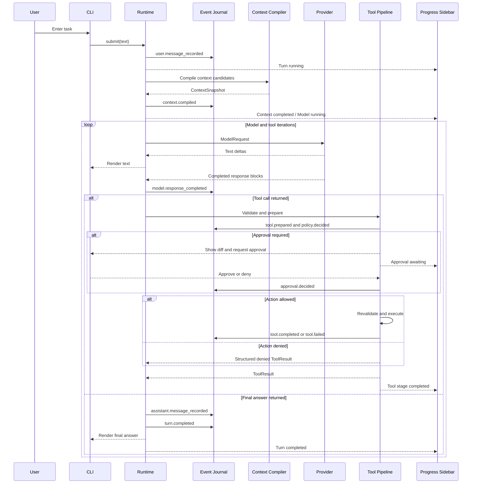
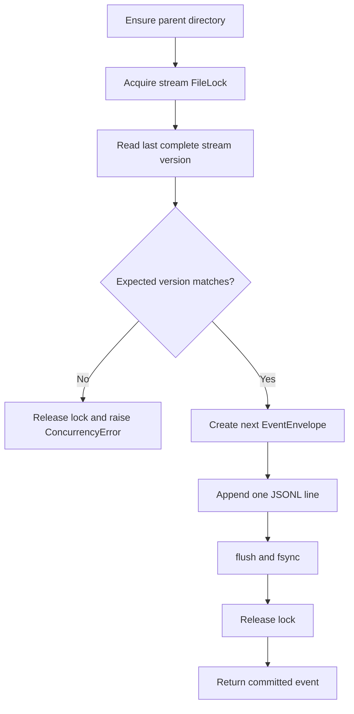
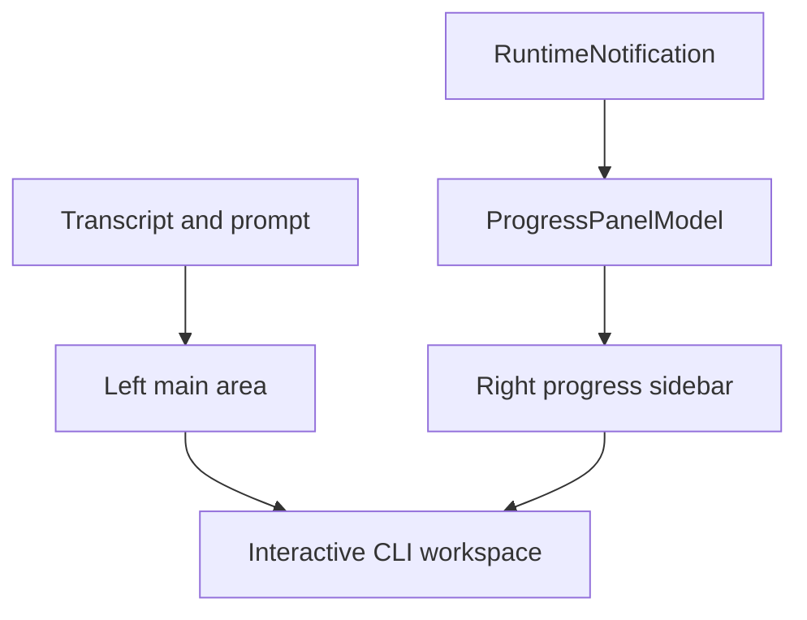

# MicroCode v0.1 MVP — 从零实现教程

> 配套需求文档：[`prd.md`](./prd.md)
>
> 目标：从空 Python 工程逐步实现一个可观察、可解释、可回放的 Code Agent
>
> 适用环境：Python 3.11+；示例命令优先使用 Windows PowerShell
>
> 原则：每个里程碑都必须可运行、可测试、可提交

## 0. 如何使用这份教程

这不是“把最终答案一次性粘贴进去”的文件清单，而是一条学习和实现路径。每个里程碑都包含：

- 本阶段要理解的核心概念。
- 要创建或修改的文件。
- 推荐的数据结构和关键代码骨架。
- 必须编写的测试。
- 手工验证方式。
- 常见错误和完成标准。

实现时遵守四条纪律：

1. **一次只完成一个里程碑。** 当前阶段测试不通过，不进入下一阶段。
2. **先写领域协议和测试，再接真实 SDK。** 大部分功能必须能离线验证。
3. **状态只能由事件重建。** 不允许为了“先跑起来”增加第二套 session 真值。
4. **副作用必须可拦截。** 文件写入和命令执行不能藏在 Agent Loop 或 Provider Adapter 中。

推荐在每个里程碑结束后创建一个小提交，例如：

```powershell
git add MicroCode
git commit -m "feat(eventlog): add append-only journal"
```

提交不是教程的硬性要求，但它能让你随时回到一个可运行状态，也方便面试时展示演进过程。

### 0.1 查看 Mermaid 流程图

本文档中的流程图使用语言标识为 `mermaid` 的标准 fenced code block。GitHub 可以直接渲染；在 VS Code 中请打开 Markdown 预览（`Ctrl+Shift+V`）。如果预览页仍只显示源码，说明当前版本或 Markdown 预览器尚未启用 Mermaid，需要安装或启用支持 Mermaid 的 Markdown 预览扩展。

Mermaid 围栏不能再嵌套在其他代码围栏中；修改图后应检查每个 Mermaid 起始围栏都只对应一个结束围栏。

## 1. 最终要构建什么

### 1.1 端到端主链路



### 1.2 里程碑总览

| 阶段 | 交付结果 | 是否需要网络 |
|---|---|---|
| M0 | Python 工程骨架和质量工具 | 仅安装依赖 |
| M1 | 领域类型与事件模型 | 否 |
| M2 | JSONL Journal、Artifact Store | 否 |
| M3 | Projection、Session、Snapshot、Replay | 否 |
| M4 | Provider Protocol 与 ScriptedProvider | 否 |
| M5 | Context Compiler、`/context`、`/why` 内核 | 否 |
| M6 | Agent Loop 与可观测 turn | 否 |
| M7 | 只读工具与 Tool Registry | 否 |
| M8 | PreparedAction、Permission、写文件和命令 | 否 |
| M9 | Anthropic/Kimi 兼容真实 Provider | 是 |
| M10 | CLI、轻量进度侧栏、Trace、Resume、Replay | 除真实对话外可离线 |
| M11 | 三层可追溯自动记忆 | 真实提取需要网络 |
| M12 | Golden Eval、安全加固、双语文档和发布验收 | 否 |

依赖关系是线性的，但 M9 故意放得较晚：先证明 Harness 正确，再接入真实模型。

### 1.3 里程碑依赖


完成前一个节点的验收再进入下一个节点；这样每个阶段都可以在离线或受控场景中独立验证。

## 2. 目标目录结构

最终结构不要求第一天全部创建。只在相应里程碑创建需要的文件：

```text
MicroCode/
├── pyproject.toml
├── README.md
├── README.zh-CN.md
├── LICENSE
├── src/
│   └── microcode/
│       ├── __init__.py
│       ├── __main__.py
│       ├── config.py
│       ├── runtime.py
│       ├── domain/
│       │   ├── events.py
│       │   ├── messages.py
│       │   └── json_types.py
│       ├── eventlog/
│       │   ├── journal.py
│       │   ├── artifacts.py
│       │   ├── snapshots.py
│       │   └── replay.py
│       ├── session/
│       │   ├── models.py
│       │   ├── projector.py
│       │   └── service.py
│       ├── provider/
│       │   ├── protocol.py
│       │   ├── scripted.py
│       │   └── anthropic.py
│       ├── context/
│       │   ├── models.py
│       │   ├── sources.py
│       │   ├── scoring.py
│       │   └── compiler.py
│       ├── agent/
│       │   ├── loop.py
│       │   └── prompts.py
│       ├── tools/
│       │   ├── protocol.py
│       │   ├── registry.py
│       │   ├── filesystem.py
│       │   ├── search.py
│       │   ├── command.py
│       │   └── ask_user.py
│       ├── actions/
│       │   ├── models.py
│       │   ├── diff.py
│       │   └── executor.py
│       ├── policy/
│       │   ├── models.py
│       │   └── engine.py
│       ├── memory/
│       │   ├── models.py
│       │   ├── projector.py
│       │   ├── extractor.py
│       │   └── service.py
│       └── cli/
│           ├── app.py
│           ├── commands.py
│           └── renderer.py
├── tests/
│   ├── unit/
│   ├── integration/
│   ├── golden/
│   └── fixtures/
└── doc/
    ├── prd.md
    └── plan.md
```

模块依赖必须大致保持：

```text
cli → runtime → agent → protocols/domain
                ├── context
                ├── provider protocol
                └── tool pipeline

runtime → eventlog → domain
projection → domain
provider implementation → provider protocol
```

禁止 `domain` 反向引用 CLI、SDK 或具体文件存储。

## 3. M0 — 建立 Python 工程

### 3.1 学习目标

- 理解 `src` layout 为什么能避免从仓库根目录误导入未安装代码。
- 建立统一的测试、格式、lint 和类型检查入口。
- 确保后续所有测试使用隔离的临时数据目录。

### 3.2 创建虚拟环境

在 `D:\vscode\projects\codeDemo\MicroCode` 执行：

```powershell
py -3.12 -m venv .venv
.\.venv\Scripts\Activate.ps1
python -m pip install --upgrade pip
```

如果只有 Python 3.11，使用 `py -3.11`。不要把 `.venv` 提交到 Git。

### 3.3 创建 `pyproject.toml`

```toml
[build-system]
requires = ["setuptools>=69"]
build-backend = "setuptools.build_meta"

[project]
name = "microcode"
version = "0.1.0"
description = "An observable, explainable and replayable coding agent"
requires-python = ">=3.11"
license = { text = "MIT" }
dependencies = [
  "anthropic",
  "filelock>=3.13",
  "prompt-toolkit>=3.0",
  "pydantic>=2.8,<3",
  "rich>=13.7",
]

[project.optional-dependencies]
dev = [
  "mypy>=1.10",
  "pytest>=8.2",
  "pytest-asyncio>=0.23",
  "ruff>=0.5",
]

[project.scripts]
microcode = "microcode.__main__:main"

[tool.setuptools.packages.find]
where = ["src"]

[tool.pytest.ini_options]
asyncio_mode = "auto"
testpaths = ["tests"]
markers = ["integration: requires a real provider or external executable"]

[tool.ruff]
line-length = 100
target-version = "py311"

[tool.ruff.lint]
select = ["E", "F", "I", "UP", "B", "ASYNC"]

[tool.mypy]
python_version = "3.11"
strict = true
packages = ["microcode"]
```

依赖版本在第一次可发布构建时再生成锁定清单；教程不假设某个未来 SDK 小版本的内部实现永远不变。

安装：

```powershell
python -m pip install -e ".[dev]"
```

### 3.4 创建最小入口

`src/microcode/__init__.py`：

```python
__version__ = "0.1.0"
```

`src/microcode/__main__.py`：

```python
import asyncio


async def async_main() -> None:
    print("MicroCode v0.1")


def main() -> None:
    asyncio.run(async_main())


if __name__ == "__main__":
    main()
```

### 3.5 配置生成状态目录

在 `config.py` 中先实现一个最小 `Paths`：

```python
from pathlib import Path
from pydantic import BaseModel


class AppPaths(BaseModel, frozen=True):
    home: Path

    @property
    def events(self) -> Path:
        return self.home / "events"

    @property
    def artifacts(self) -> Path:
        return self.home / "artifacts" / "sha256"


def default_app_paths() -> AppPaths:
    return AppPaths(home=Path.home() / ".microcode")
```

所有 service 都通过构造函数接收 `AppPaths`，测试传入 `tmp_path`。不要在模块 import 时创建目录，也不要在测试中访问真实 home。

### 3.6 第一组检查

```powershell
microcode
pytest
ruff check src tests
ruff format --check src tests
mypy src
```

### 3.7 完成标准

- 命令输出版本号。
- 空测试集和静态检查能运行。
- `.gitignore` 包含 `.venv/`、`__pycache__/`、`.pytest_cache/`、`.mypy_cache/`、`.ruff_cache/`。
- 项目目录中没有生成 `~/.microcode` 的替代目录。

## 4. M1 — 领域类型与事件模型

### 4.1 为什么先做事件

普通 Demo 往往从 `messages = []` 开始，后来再补 session 和 trace。这样 `messages` 会成为事实源，Event Log 只能记录“部分日志”。MicroCode 要反过来：先定义发生过什么，再由事件生成 `messages` 视图。

### 4.2 JSON 类型

在 `domain/json_types.py` 定义递归 JSON 类型，防止 payload 偷塞 SDK 对象、`Path` 或异常实例：

```python
from typing import TypeAlias

JsonScalar: TypeAlias = str | int | float | bool | None
JsonValue: TypeAlias = JsonScalar | list["JsonValue"] | dict[str, "JsonValue"]
JsonObject: TypeAlias = dict[str, JsonValue]
```

### 4.3 EventEnvelope

在 `domain/events.py`：

```python
from datetime import datetime, timezone
from uuid import uuid4
from pydantic import BaseModel, ConfigDict, Field
from .json_types import JsonObject


class EventEnvelope(BaseModel):
    model_config = ConfigDict(frozen=True, extra="forbid")

    schema_version: int = 1
    event_id: str = Field(default_factory=lambda: str(uuid4()))
    stream_id: str
    stream_version: int
    occurred_at: datetime = Field(default_factory=lambda: datetime.now(timezone.utc))
    event_type: str
    session_id: str | None = None
    run_id: str | None = None
    turn_id: str | None = None
    causation_id: str | None = None
    correlation_id: str | None = None
    payload: JsonObject
```

创建一个事件工厂，但不要让工厂自己猜 `stream_version`；版本只能由 Journal 在持有锁时确定。

### 4.4 先约定事件命名

在同一文件维护常量或 `StrEnum`。MVP 初始集合：

```text
session.started
session.resumed
session.provider_pinned
turn.started
user.message_recorded
context.compiled
model.requested
model.response_completed
model.failed
tool.requested
tool.prepared
policy.decided
approval.requested
approval.decided
tool.completed
tool.failed
assistant.message_recorded
turn.completed
turn.failed
memory.consent_recorded
memory.extraction_requested
memory.extraction_completed
memory.extraction_failed
memory.proposed
memory.accepted
memory.rejected
memory.superseded
```

事件名使用过去式，因为它描述已经发生的事实。`tool.execute` 是命令，`tool.completed` 才是事件。

### 4.5 Payload 校验策略

不要一开始创建二十多个 Envelope 子类。建议：

- 每种 payload 使用独立 Pydantic model。
- `EventEnvelope.payload` 序列化后仍是 JSON dict。
- 一个 `PayloadRegistry` 按 `event_type` 在读取时验证 payload。
- 未知新事件在严格模式报错，在诊断模式可以显示但不投影。

例如：

```python
class SessionStarted(BaseModel):
    project_root: str
    provider: str
    model: str


class UserMessageRecorded(BaseModel):
    text_ref: str
```

### 4.6 必写测试

`tests/unit/test_events.py`：

- EventEnvelope 可序列化为一行 JSON 并恢复。
- 时间必须带 UTC timezone。
- `extra="forbid"` 能发现拼错字段。
- payload 中出现 `Path` 或任意 Python 对象时验证失败。
- frozen model 不能被原地修改。

### 4.7 常见错误

- 用 `datetime.now()` 生成无时区时间。
- 把 Provider SDK response 直接塞入 payload。
- 用 list index 当事件版本，导致并发追加时无法检查冲突。
- 为了方便在 Envelope 中放任意 `Any`，失去事件 schema 的意义。

### 4.8 完成标准

可以用一个小测试构造 `session.started`，序列化为稳定 JSON，再完整读回。

## 5. M2 — JSONL Journal 与 Artifact Store

### 5.1 Journal 接口

在 `eventlog/journal.py` 先定义 Protocol：

```python
from collections.abc import Iterable
from typing import Protocol
from microcode.domain.events import EventEnvelope
from microcode.domain.json_types import JsonObject


class EventJournal(Protocol):
    def append(
        self,
        *,
        stream_id: str,
        expected_version: int,
        event_type: str,
        payload: JsonObject,
        session_id: str | None = None,
        run_id: str | None = None,
        turn_id: str | None = None,
        causation_id: str | None = None,
        correlation_id: str | None = None,
    ) -> EventEnvelope: ...

    def read(self, stream_id: str, after_version: int = 0) -> Iterable[EventEnvelope]: ...
```

MVP 先使用同步文件 I/O。追加一行很短，放进 asyncio 应用不会成为主要瓶颈；不要为了“全异步”引入不可靠的异步文件库。如果之后测量显示阻塞，再把存储端口移到 worker。

### 5.2 JSONL 存储布局

将 stream ID 映射到安全文件路径，不允许直接把用户输入当文件名：

```text
session:<uuid>             → events/sessions/<uuid>.jsonl
memory:user                → events/memory/user.jsonl
memory:project:<sha256>    → events/memory/projects/<sha256>.jsonl
```

项目 ID 使用规范化 `project_root` 字符串的 SHA-256，不泄露完整路径到文件名。

### 5.3 正确的 append 顺序

`JsonlEventJournal.append()` 必须：

1. 创建父目录。
2. 获取该 stream 的 `FileLock`。
3. 在锁内读取最后一个完整事件的 `stream_version`。
4. 与 `expected_version` 比较，不一致抛 `ConcurrencyError`。
5. 构造 `stream_version + 1` 的 Envelope。
6. 使用 UTF-8 紧凑 JSON 序列化，确保一条事件只有一行。
7. 追加 `json + "\n"`。
8. `flush()`。
9. `os.fsync(file.fileno())`。
10. 释放锁并返回事件。

不要先返回成功再后台刷盘，否则进程退出时“已显示成功”的动作可能没有事实记录。



这里的“返回”只发生在 `fsync` 之后，因此 UI 看到的成功状态总能追溯到一个已经落盘的 EventEnvelope。

### 5.4 损坏尾行处理

读取时记录 byte offset。遇到非法 JSON：

- 如果是最后一行且没有换行，抛 `TruncatedEventLogError(path, offset)`。
- 如果是中间行，抛 `CorruptEventLogError`。
- 不要默认跳过，因为跳过会改变后续 Projection。

以后可以增加显式 repair 命令；MVP 只做诊断。

### 5.5 Artifact Store

在 `eventlog/artifacts.py`：

```python
class ArtifactRef(BaseModel, frozen=True):
    digest: str
    size: int
    media_type: str


class ArtifactStore(Protocol):
    def put_bytes(self, data: bytes, media_type: str) -> ArtifactRef: ...
    def get_bytes(self, ref: ArtifactRef) -> bytes: ...
```

再定义一个统一的 `ContentRef`，让事件、上下文、消息和工具结果不必分别发明“大内容”表示：

```python
class ContentRef(BaseModel, frozen=True):
    inline_text: str | None = None
    artifact: ArtifactRef | None = None
    preview: str | None = None
    digest: str
    size: int
```

增加 model validator，要求 `inline_text` 与 `artifact` 恰好存在一个。`preview` 只用于展示，不得被当成完整内容。

实现步骤：

1. 计算 `sha256(data).hexdigest()`。
2. 路径为 `artifacts/sha256/<前两位>/<digest>`。
3. 已存在相同 digest 时直接复用。
4. 不存在时写同目录临时文件，`flush + fsync`，再 `os.replace()`。
5. 读取时重新计算 digest；不一致抛 `ArtifactIntegrityError`。

提供 `put_text()`/`get_text()` 小封装。事件 payload 只保存 `ArtifactRef.model_dump(mode="json")`。

### 5.6 大小阈值

定义统一 `ContentStore`：

- 小于 32 KiB：事件可内联，同时记录 digest。
- 大于等于 32 KiB：写 Artifact，事件保存 preview、ref 和原始 size。
- preview 要明确标记截断，不让模型或用户误以为是完整输出。

### 5.7 必写测试

`test_journal.py`：

- append 三个事件后版本为 1、2、3。
- expected version 错误时不追加。
- 两个 Journal 实例竞争同一 stream 时只有正确版本成功。
- UTF-8 中文和换行内容能 round-trip。
- 人工写入半行后能够报出路径与 offset。

`test_artifacts.py`：

- 相同内容返回相同 digest。
- 不同内容返回不同 digest。
- 篡改文件后读取失败。
- 并发写相同内容不会留下多个最终文件。

### 5.8 完成标准

用 100 个事件构造 stream，重启 Python 进程后仍能顺序读回；删除任意 Artifact 后能得到明确缺失错误。

## 6. M3 — Projection、Session、Snapshot 与 Replay

### 6.1 SessionState 只是投影视图

在 `session/models.py`：

```python
class SessionState(BaseModel, frozen=True):
    session_id: str
    project_root: str
    provider: str
    model: str
    stream_version: int = 0
    status: str = "active"
    messages: tuple["ModelMessage", ...] = ()
    latest_context_snapshot_id: str | None = None
    active_turn_id: str | None = None
```

`messages` 是事件折叠结果，不是外部可以任意 append 的列表。

### 6.2 纯 Projector

`session/projector.py`：

```python
def apply_session_event(state: SessionState | None, event: EventEnvelope) -> SessionState:
    match event.event_type:
        case "session.started":
            ...
        case "user.message_recorded":
            ...
        case "assistant.message_recorded":
            ...
        case "context.compiled":
            ...
        case "turn.completed" | "turn.failed":
            ...
        case _:
            ...
```

规则：

- 不读取当前时间、环境变量或磁盘。
- 不生成随机 ID。
- 不调用 Provider 或工具。
- 相同初始状态 + 相同事件必须得到相同结果。
- 对不影响 SessionState 的已知事件，只更新 `stream_version`。

### 6.3 SessionService

`session/service.py` 负责编排事件：

- `create(project_root, provider, model) -> SessionState`
- `load(session_id) -> SessionState`
- `resume(session_id) -> SessionState`
- `list_for_project(project_root) -> list[SessionSummary]`

创建 session 时依次追加：

1. `session.started`
2. `session.provider_pinned`

不要在 `create()` 旁边另写一份 `session.json`。

### 6.4 Snapshot

Snapshot 文件包含：

```json
{
  "snapshot_schema_version": 1,
  "stream_id": "session:...",
  "stream_version": 120,
  "state": { "...": "..." }
}
```

加载流程：

1. 尝试读取 Snapshot。
2. 验证 schema 和 stream ID。
3. 从 `stream_version + 1` 读取剩余事件并投影。
4. Snapshot 无效时从 version 1 全量重建。

Snapshot 写失败不能影响事实事件。它只是性能缓存。

### 6.5 Trace 与 Replay 内核

`eventlog/replay.py` 提供两个不同接口：

- `rebuild(stream_id, target_version=None)`：返回目标版本状态。
- `timeline(stream_id)`：返回适合展示的 `TraceItem` 序列。

`TraceItem` 包含时间、event type、turn、简短说明、artifact refs、causation/correlation。Replay renderer 只消费这些 item。

最重要的设计测试：给 ReplayService 注入会在调用时直接失败的 Provider 和 Tool Executor；Replay 仍应通过。更简单的做法是 ReplayService 的构造函数根本不接收这两者。

### 6.6 必写测试

- 空 Event Log 不能伪造 SessionState。
- session create/load 的 state 完全相同。
- 删除 Snapshot 后重建结果相同。
- 将同一事件序列投影两次结果相同。
- `target_version=5` 只恢复到第五个事件。
- Replay timeline 顺序稳定。
- Replay 模块的依赖图中不存在 Provider/Tool Executor。

### 6.7 完成标准

写一个离线脚本创建 session、追加用户和助手消息、删除 Snapshot、恢复并播放时间线；输出一致且无外部调用。

## 7. M4 — Provider Protocol、消息模型与 ScriptedProvider

### 7.1 不让 Provider 类型污染核心层

在 `domain/messages.py` 定义可移植语义块：

```python
class TextBlock(BaseModel, frozen=True):
    type: Literal["text"] = "text"
    text: str


class ToolUseBlock(BaseModel, frozen=True):
    type: Literal["tool_use"] = "tool_use"
    tool_call_id: str
    name: str
    arguments: JsonObject


class ToolResultBlock(BaseModel, frozen=True):
    type: Literal["tool_result"] = "tool_result"
    tool_call_id: str
    content_ref: ContentRef
    is_error: bool = False
```

`ModelMessage` 保存 role 和有序 blocks。不要把 text、tool_use 分成两个互不保持顺序的数组。

### 7.2 Provider Protocol

`provider/protocol.py`：

```python
class ModelRequest(BaseModel, frozen=True):
    provider: str
    model: str
    system_blocks: tuple[TextBlock, ...]
    messages: tuple[ModelMessage, ...]
    tools: tuple[ToolDefinition, ...]
    max_output_tokens: int


class TextDelta(BaseModel, frozen=True):
    type: Literal["text_delta"] = "text_delta"
    text: str


class ResponseCompleted(BaseModel, frozen=True):
    type: Literal["response_completed"] = "response_completed"
    blocks: tuple[ContentBlock, ...]
    usage: Usage | None
    stop_reason: str | None
    native_artifact_ref: ArtifactRef | None


ProviderEvent = TextDelta | ResponseCompleted


class Provider(Protocol):
    name: str
    async def stream(self, request: ModelRequest) -> AsyncIterator[ProviderEvent]: ...
```

`stop_reason` 只用于诊断，不作为“是否执行工具”的唯一判断。Agent Loop 应检查最终 blocks 中是否存在 `ToolUseBlock`。

### 7.3 ScriptedProvider

`provider/scripted.py` 接收一个响应队列：

```python
provider = ScriptedProvider([
    ScriptedResponse(blocks=(ToolUseBlock(...),)),
    ScriptedResponse(blocks=(TextBlock(text="Done"),)),
])
```

它需要：

- 记录收到的每个 `ModelRequest`，便于断言上下文和工具结果。
- 可以按片段发出 text delta。
- 可以注入 timeout、rate limit、未知 block 等错误。
- 队列耗尽时抛明确的 `ScriptExhaustedError`。

### 7.4 Provider 原生信息

可移植 blocks 用于 Agent Loop；Provider 原始 response/stream summary 以 Artifact 保存。两者不能互相替代：

- 只存原生 response 会让核心层依赖厂商。
- 只存统一 blocks 会丢失 thinking、signature、未来协议字段和调试证据。

### 7.5 必写测试

- ScriptedProvider 保留响应块顺序。
- delta 合并后的文本等于 completed text。
- tool call ID 原样保留。
- 请求记录包含 provider/model 和工具 schema。
- 队列耗尽和注入错误可预测。

### 7.6 完成标准

不连接网络即可模拟“模型请求读取文件 → 收到工具结果 → 输出最终答案”的两次模型响应。

## 8. M5 — Context Compiler

### 8.1 把 Context 当编译产物

Context Compiler 不直接拼长字符串。它经过：

```text
collect → normalize → deduplicate → score → select → render → snapshot
```

每个阶段都保留足够信息供 `/context` 和 `/why` 使用。

### 8.2 数据模型

在 `context/models.py` 定义：

```python
class ContextCandidate(BaseModel, frozen=True):
    candidate_id: str
    source: str
    scope: str
    label: str
    content_ref: ContentRef
    content_digest: str
    estimated_tokens: int
    metadata: JsonObject = Field(default_factory=dict)


class ScoredCandidate(BaseModel, frozen=True):
    candidate: ContextCandidate
    score: float
    factors: dict[str, float]


class ContextDecision(BaseModel, frozen=True):
    candidate_id: str
    included: bool
    reason: str
    final_position: int | None = None


class ContextSnapshot(BaseModel, frozen=True):
    snapshot_id: str
    budget: ContextBudget
    candidates: tuple[ScoredCandidate, ...]
    decisions: tuple[ContextDecision, ...]
    rendered_context_ref: ContentRef
    rendered_digest: str
```

所有容器默认值都使用 `Field(default_factory=...)`，避免实例间共享可变对象。

### 8.3 ContextSource Protocol

```python
class ContextSource(Protocol):
    name: str
    async def collect(self, request: ContextRequest) -> list[ContextCandidate]: ...
```

先实现以下来源：

1. `SystemInstructionSource`
2. `CurrentUserMessageSource`
3. `ConversationHistorySource`
4. `ProjectInstructionSource`
5. `WorkingSetSource`
6. `MemorySource`（M11 接真实 projection，当前可返回空）

### 8.4 `MICRO.md` 与 `AGENTS.md` 扫描

给定固定的 `project_root` 和 `cwd`：

1. 确认 cwd 在 project root 内。
2. 从 project root 开始逐级走到 cwd。
3. 每一级按固定次序查找 `AGENTS.md`、`MICRO.md`。
4. 每个文件形成独立 candidate，并记录目录深度。
5. 更靠近 cwd 的说明获得更高 locality 分。
6. 文件不存在不是错误。

项目 root 可通过向上查找 `.git` 获得；找不到时使用启动 cwd，并在 session 中固定，后续不重新猜。

### 8.5 确定性评分

在 `context/scoring.py` 用一个简单、可解释的公式开始：

```text
score = source_priority
      + explicit_reference_bonus
      + lexical_overlap_bonus
      + recency_bonus
      + scope_bonus
      + locality_bonus
      - size_penalty
```

建议初值：

| 因素 | 分值范围 |
|---|---:|
| system/current user | 100，始终包含 |
| project instructions | 基础 80–90 |
| recent conversation | 基础 55–75 |
| explicitly referenced path | +30 |
| lexical overlap | 0–20 |
| recency | 0–15 |
| matching memory scope | 0–10 |
| large content penalty | 0–20 |

词项处理先做小写、字母数字/下划线分词和 Jaccard overlap，不要一上来引入 embedding。相同输入必须得到相同得分。

排序必须有稳定 tie-breaker，例如：

```python
key=lambda item: (-item.score, item.candidate.source, item.candidate.candidate_id)
```

### 8.6 Token 预算

MVP 用 `max(1, len(text) // 4)` 作为近似英文 token；中文可按字符数更保守估计。配置示例：

```python
ContextBudget(
    model_limit=128_000,
    reserved_output=8_000,
    reserved_tools=12_000,
    safety_margin=8_000,
)
```

可用输入预算为四者相减。128k 是保守默认，不代表所有模型真实窗口；Provider 配置可覆盖。强制包含项如果已经超预算，应给出 `ContextBudgetExceeded`，不能静默删除当前用户输入。

### 8.7 去重和装箱

- 使用 `content_digest` 去重。
- 同 digest 多来源时保留优先级最高者，并在被排除项记录 `duplicate_of:<id>`。
- 强制项先放入。
- 其余按稳定排序贪心装箱。
- 超预算项记录 `budget_exceeded`，不能直接从 snapshot 消失。

### 8.8 `/context` 与 `/why` 的服务接口

先不做 CLI，只实现可渲染 DTO：

- `describe_context(snapshot) -> ContextReport`
- `explain_candidate(snapshot, selector) -> ContextExplanation`

selector 支持 candidate ID、完整路径和唯一 label。匹配多项时返回候选列表，不偷偷选第一个。

### 8.9 必写测试

- 同一输入运行十次，选择顺序和 digest 相同。
- 显式提及的文件分数提高。
- 重复内容只选一次，排除原因可见。
- 超预算项仍出现在 decision 中。
- root-to-cwd 的说明文件顺序正确。
- cwd 越界被拒绝。
- `/why` 能解释 included、duplicate、budget_exceeded 三类结果。

### 8.10 完成标准

给一个临时项目放置两层 `AGENTS.md`、一个 `MICRO.md` 和若干历史消息，能够打印稳定的 ContextReport，并解释每一项去留。

## 9. M6 — Agent Loop 与完整事件链

### 9.1 Agent Loop 的边界

Agent Loop 负责：

- 开始 turn。
- 请求 Context Compiler。
- 调用 Provider。
- 收集完整响应块。
- 把 tool calls 交给 Tool Pipeline。
- 将工具结果放入下一轮模型消息。
- 在最终文本出现时完成 turn。

Agent Loop 不负责：

- 直接写 JSONL 文件。
- 拼接项目说明。
- 判断危险命令。
- 显示 Rich 表格。
- 直接读写文件。

### 9.2 Runtime Port

给 Loop 注入一个 `EventRecorder`，由 Runtime 负责追加事件并返回 Envelope：

```python
class EventRecorder(Protocol):
    def record(
        self,
        event_type: str,
        payload: JsonObject,
        *,
        causation_id: str | None = None,
        correlation_id: str | None = None,
    ) -> EventEnvelope: ...
```

这让 Loop 不需要知道 stream version 和文件路径。

### 9.3 单个 turn 的事件顺序

至少遵循：

```text
turn.started
user.message_recorded
context.compiled
model.requested
model.response_completed | model.failed
[tool pipeline events + next model.requested ...]
assistant.message_recorded
turn.completed | turn.failed
```

每轮创建一个 correlation ID。工具的 `causation_id` 指向产生它的 model response；工具结果后的下一次 model request 指向相应 tool result。

### 9.4 Loop 骨架

```python
async def run_turn(self, user_text: str) -> TurnResult:
    turn = self.recorder.record("turn.started", {...})
    user_event = self.recorder.record(
        "user.message_recorded", {...}, causation_id=turn.event_id
    )

    for iteration in range(self.limits.max_model_iterations):
        snapshot = await self.context_compiler.compile(...)
        self.recorder.record("context.compiled", snapshot_payload(snapshot), ...)

        request = self.request_builder.build(snapshot, ...)
        request_event = self.recorder.record("model.requested", summarize(request), ...)
        completed = await self._collect_provider_response(request)
        response_event = self.recorder.record(
            "model.response_completed", response_payload(completed),
            causation_id=request_event.event_id,
        )

        tool_calls = [b for b in completed.blocks if isinstance(b, ToolUseBlock)]
        if not tool_calls:
            return self._finish_turn(completed, response_event)

        for call in tool_calls:
            await self.tool_pipeline.handle(call, causation_id=response_event.event_id)

    raise AgentLimitExceeded(...)
```

实际实现要在 `try/except asyncio.CancelledError` 和普通异常路径记录 `turn.failed`，然后重新抛取消或返回明确失败。

### 9.5 限制

配置：

- `max_model_iterations = 20`
- `max_tool_calls = 10`
- `max_turn_seconds = 600`
- Provider 单次请求另有 timeout

限制触发时要告诉模型/用户具体哪项耗尽，并记录 usage；不能无限循环。

### 9.6 流式 UI 事件与持久事件分开

定义轻量 `RuntimeNotification`：

- `text_delta`
- `spinner_changed`
- `tool_preview_available`
- `approval_needed`
- `progress_changed`（当前阶段或状态发生变化）

它们发给 CLI，但不会逐条写 Journal。`progress_changed` 驱动 M10 的 `ProgressPanelModel`；该模型只显示 Context、Model、Tool、Approval、Memory 的当前状态，不保存另一份业务事实。最终 `model.response_completed` 和 `assistant.message_recorded` 才是持久事实。

### 9.7 当前阶段的 Tool Pipeline

先注入一个 Fake Tool Pipeline，它根据 tool name 返回固定结果并记录调用。M7/M8 再换真实实现。

### 9.8 必写测试

使用 ScriptedProvider：

- 一次纯文本响应正确完成 turn。
- 第一次响应 tool call、第二次响应 final text。
- stop reason 非 tool_use 但 blocks 有 tool call 时仍执行工具。
- stop reason 是 tool_use 但没有有效 tool block 时明确失败。
- 超过 model/tool 上限记录 `turn.failed`。
- Provider 抛错产生 `model.failed` 和 `turn.failed`。
- 取消任务产生取消事件，不能留下“active turn”投影。
- 事件的 causation/correlation 链正确。

### 9.9 完成标准

通过一个完全离线的 scripted 场景输出最终答案，并用 `/trace` 的底层 report 看见完整因果链。

## 10. M7 — Tool Protocol、Registry 与只读工具

### 10.1 Schema 单一来源

每个工具使用 Pydantic 输入模型，同时生成 Provider JSON Schema：

```python
class ReadFileInput(BaseModel):
    path: str
    offset: int = Field(default=0, ge=0)
    limit: int = Field(default=200, ge=1, le=2000)


class ReadFileTool:
    name = "read_file"
    description = "Read a UTF-8 text file within the project."
    input_model = ReadFileInput

    def definition(self) -> ToolDefinition:
        return ToolDefinition(
            name=self.name,
            description=self.description,
            input_schema=self.input_model.model_json_schema(),
        )
```

不要手写第二份 JSON Schema，否则字段默认值和约束迟早不同步。

### 10.2 Tool Protocol

所有工具统一走 prepare/execute：

```python
class Tool(Protocol):
    name: str
    description: str
    input_model: type[BaseModel]

    async def prepare(self, raw_input: JsonObject, ctx: ToolContext) -> PreparedToolCall: ...
    async def execute(self, prepared: PreparedToolCall, ctx: ToolContext) -> ToolResult: ...
```

只读工具的 prepare 也有价值：它负责参数校验、规范化路径和生成 policy subject。

### 10.3 Registry

`ToolRegistry`：

- 注册时拒绝重复 name。
- `definitions()` 使用 Pydantic schema 生成稳定排序列表。
- `get(name)` 未找到时返回结构化 ToolNotFound，不抛到 CLI 顶层。
- 不在 Registry 内做 permission；Registry 只负责发现和分派。

### 10.4 路径防护辅助函数

```python
def resolve_project_path(project_root: Path, user_path: str) -> Path:
    candidate = (project_root / user_path).resolve()
    candidate.relative_to(project_root.resolve())
    return candidate
```

需要额外测试 symlink。Windows 下还要对大小写和不同 drive 做测试；`Path.relative_to()` 失败即越界。

### 10.5 实现三个只读工具

`list_files`：

- 输入 path、可选 pattern、max_results。
- 跳过 `.git` 和常见生成目录；配置可覆盖。
- 输出相对 project root 的 POSIX 风格路径。
- 稳定排序，超过上限明确截断。

`search_text`：

- 首选 `rg --json` 或稳定可解析输出。
- 使用 `asyncio.create_subprocess_exec`，绝不 `shell=True`。
- 明确传入 cwd、pattern、glob、max_results。
- `rg` 不存在时返回可诊断错误；MVP 不必自己重写完整 grep。
- 搜索无匹配是成功的空结果，不是工具异常。

`read_file`：

- 只支持普通文本文件。
- 使用 offset/limit 按行读取。
- 返回行号、总行数、是否截断、digest。
- 二进制、无法解码或超大单行给出明确错误。

### 10.6 输出统一进入 ContentStore

`ToolResult` 不直接塞任意大字符串：

```python
class ToolResult(BaseModel, frozen=True):
    content: ContentRef
    summary: str
    is_error: bool
    metadata: JsonObject
```

Pipeline 把 ToolResult 写 `tool.completed`，同时把可发送给模型的预览加入消息投影。

### 10.7 必写测试

- Pydantic schema 和实际校验来自同一 model。
- 重复工具注册失败。
- `../`、绝对路径、symlink 越界失败。
- list 结果稳定且遵守上限。
- search 无匹配成功返回空。
- read 分页无 off-by-one。
- 大输出写 Artifact，事件只含 ref/preview。

### 10.8 完成标准

把 M6 的 Fake Pipeline 换成真实 Registry，ScriptedProvider 能列目录、搜索、读取，然后给出最终文本。

## 11. M8 — PreparedAction、Policy、写文件和命令

### 11.1 先定义动作，不先写工具

`actions/models.py`：

```python
class RiskLevel(StrEnum):
    LOW = "low"
    MEDIUM = "medium"
    HIGH = "high"


class PreparedAction(BaseModel, frozen=True):
    action_id: str
    tool_call_id: str
    effect: str
    normalized_target: str | None
    preview: ContentRef | None
    before_digest: str | None
    risk: RiskLevel
    executable: JsonObject
```

`executable` 是 Executor 理解的规范化计划，不是任意 Python closure，因此能写事件、展示和测试。

### 11.2 Policy 模型

```python
class DecisionKind(StrEnum):
    ALLOW = "allow"
    ASK = "ask"
    DENY = "deny"


class PolicyDecision(BaseModel, frozen=True):
    decision: DecisionKind
    rule_id: str
    reason: str
    risk: RiskLevel
```

判定优先级：

1. 硬编码安全 deny。
2. 项目配置 deny。
3. 项目配置 allow/ask。
4. 内置低风险 allow。
5. 默认 ask。

所有 decision 记录 rule ID，`/trace` 才能回答“为什么询问/拒绝”。

### 11.3 单文件 diff

使用标准库 `difflib.unified_diff`，不要自写 LCS。`edit_file` 流程：

1. 解析并规范化 path。
2. 读取原始 bytes/text，计算 before digest。
3. 检查 `old_text` 出现次数。
4. 不是恰好一次则 prepare 失败。
5. 生成 after text 和 unified diff。
6. diff 写 ContentStore。
7. 返回 `PreparedAction(effect="file.modify")`。

`write_file`：

- 文件不存在时 `file.create`。
- 存在时 `file.modify`。
- 内容相同则返回 no-op，不请求审批也不写盘，但仍记录结果。
- delete/rename 不在 MVP。

### 11.4 审批后防止 TOCTOU

Executor 执行前重新读取目标：

- 当前 digest 必须等于 `before_digest`。
- 新建文件必须仍不存在。
- 不一致抛 `StalePreparedActionError`，要求模型重新 read/prepare。

写入步骤：

1. 在目标同目录创建临时文件。
2. 写 UTF-8 内容。
3. `flush + fsync`。
4. 尽量保留原文件 mode。
5. `os.replace(temp, target)`。
6. 计算并记录 after digest。

### 11.5 ApprovalPort

```python
class ApprovalPort(Protocol):
    async def request(self, action: PreparedAction, decision: PolicyDecision) -> bool: ...
```

单元测试使用 `AlwaysApprove`、`AlwaysDeny` 和 `RecordingApproval`。CLI 实现放到 M10。工具层不得直接 `input()`。

### 11.6 结构化 `run_command`

输入模型：

```python
class RunCommandInput(BaseModel):
    executable: str
    args: list[str] = Field(default_factory=list)
    timeout_seconds: int = Field(default=60, ge=1, le=600)
```

执行：

```python
process = await asyncio.create_subprocess_exec(
    executable,
    *args,
    cwd=project_root,
    stdout=asyncio.subprocess.PIPE,
    stderr=asyncio.subprocess.PIPE,
)
```

禁止 `shell=True`。Policy 对 executable 和 args 分开判断，不能用字符串前缀 `startswith("git status")`。

建议内置：

- allow：`git status`、`git diff`、`rg ...`。
- ask：`pytest`、`python -m pytest`、formatters、package installers、普通构建命令。
- deny：破坏性文件系统命令、强制推送、明显指向 cwd 外的目标。

测试命令可能生成 cache，所以 balanced policy 使用 ask 是合理的。

命令输出必须同时记录 exit code、duration、stdout/stderr ref、timed_out。超时后终止进程；Windows 和 POSIX 终止行为分别测试。

### 11.7 `ask_user` 工具

`ask_user` 用于模型缺少关键产品选择时向用户提问，不用于替代文件/命令审批：

```python
class AskUserInput(BaseModel):
    question: str = Field(min_length=1, max_length=1000)
    choices: list[str] = Field(default_factory=list, max_length=10)
```

为它定义单独的 `UserInputPort`：

```python
class UserInputPort(Protocol):
    async def ask(self, question: str, choices: tuple[str, ...]) -> str: ...
```

MVP 一次只处理一个问题。问题和回答作为 tool requested/completed 事件的一部分保存，但回答仍经过 ContentStore，且 secret filter 可以阻止明显密钥进入长期记忆。`ask_user` 的 policy 默认为 allow；CLI 不可用（例如非交互模式）时返回结构化错误，不应永久等待。

测试使用 `ScriptedUserInput`，断言问题、choices、回答和事件链。ApprovalPort 与 UserInputPort 必须是两个接口，防止模型通过普通提问绕过安全审批。

### 11.8 完整 Tool Pipeline

按严格顺序实现：

```text
tool.requested
→ validate input
→ prepare
→ tool.prepared
→ policy.decided
→ if ask: approval.requested → approval.decided
→ if allowed: execute → tool.completed/tool.failed
→ if denied: structured denied ToolResult
```

拒绝不是 Python exception 泄露给模型，而是一个 `is_error=True` 的结构化 ToolResult，说明用户/策略拒绝，模型可以调整方案。

### 11.9 必写测试

- write prepare 后、approval 前文件不变。
- deny 后 Executor 调用次数为 0。
- approve 后只写目标文件。
- 审批后外部修改文件会触发 digest 冲突。
- edit 0 次和多次匹配都失败。
- create 时目标突然出现会失败。
- cwd 外路径、symlink 逃逸 deny。
- `run_command` 不经过 shell；含 `&`、`;` 的 arg 作为普通参数传递。
- 超时记录部分输出并终止。
- ask_user 和安全审批使用不同端口；非交互模式立即返回错误。
- 每条路径都有完整事件顺序。

### 11.10 完成标准

ScriptedProvider 可以请求单文件修改。测试分别批准和拒绝：批准时内容正确，拒绝时磁盘完全不变，两种情况 trace 都完整。

## 12. M9 — 接入 Anthropic/Kimi 兼容 Provider

### 12.1 配置

使用环境变量：

```text
ANTHROPIC_API_KEY
ANTHROPIC_BASE_URL       # 可选；Kimi 兼容端点示例为 https://api.moonshot.cn/anthropic
MODEL_ID                 # 当前工作区验证示例为 kimi-k2.7-code
```

PowerShell 当前会话设置示例：

```powershell
$env:ANTHROPIC_API_KEY = "your-key"
$env:ANTHROPIC_BASE_URL = "https://api.moonshot.cn/anthropic"
$env:MODEL_ID = "kimi-k2.7-code"
```

不要把真实 key 写入文档、Event Log、测试 fixture 或 Git。正式实现时模型名称和端点以用户账户实际支持为准。

### 12.2 先做非流式 smoke test

在正式 Adapter 外写一个 `tests/integration/test_anthropic_smoke.py`，使用 `@pytest.mark.integration`，验证：

- key/base URL/model 配置可用。
- 简单文本请求能返回。
- 一个最小工具 schema 能产生 tool use。

默认测试命令排除 integration；显式运行：

```powershell
pytest -m integration -k anthropic_smoke -s
```

### 12.3 AsyncAnthropic Adapter

在 `provider/anthropic.py`：

1. 构造 `AsyncAnthropic(api_key=..., base_url=...)`。
2. 将 portable message blocks 按原顺序转为 Messages API blocks。
3. 将 Pydantic tool schema 转为 Anthropic tool definitions。
4. 使用 SDK 当前官方 streaming helper。
5. text delta 转为临时 `TextDelta`。
6. 增量 tool JSON 必须完整累积并在 block 结束时验证。
7. 完整响应转为有序 portable blocks。
8. 原生完成数据/重要 stream summary 写 Artifact。
9. usage、stop reason、model 进入 completed 事件。

SDK 的具体事件类名可能升级。实现时只允许 Adapter 依赖它们，并根据当前官方文档更新；核心 Protocol 和测试 fixture 不随 SDK 事件命名变化。

### 12.4 thinking/signature 与未知块

不要把未知块静默丢弃：

- 已理解的 text/tool blocks 转 portable 类型。
- thinking/signature 保存在 native artifact，并在 portable metadata 中保留引用。
- 无法理解且会影响工具执行的块要让请求失败并记录诊断。
- 只影响展示的未知块可保存在 artifact 后继续。

### 12.5 重试

重试只覆盖“请求尚未产生不可安全重复副作用”的 Provider 调用：

- 429、连接错误、部分 5xx：最多 3 次。
- 建议退避 0.5s、2s、8s，加小幅 jitter。
- 明确的 4xx 参数错误不重试。
- 每次 attempt 发 transient notification；最终只记录一个模型失败或完成事实，同时 payload 含 attempts。

如果 streaming 已经向 UI 输出部分文本后连接中断，不要把两次流拼成一句假响应。当前 attempt 失败，是否重试必须清晰标记，并只持久化最终完整 response。

### 12.6 Provider pinning

创建 session 时记录 provider、model、base URL 的非敏感标识。Resume 时：

- 配置一致才允许继续真实对话。
- 不一致时允许只读 trace/replay。
- 用户需要换模型时创建新 session；MVP 不做 fork。

### 12.7 Contract tests

将脱敏后的 Provider 原生响应 fixture 放在 `tests/fixtures/provider/`：

- text only。
- text + tool use。
- multiple ordered blocks。
- malformed tool JSON。
- thinking/signature（如果端点支持）。
- rate limit/error mapping。

Adapter contract test 不访问网络，但验证 fixture 到 portable blocks 的映射。

### 12.8 完成标准

真实模型能够在临时示例项目中调用 `read_file`，返回最终答案；然后请求 `edit_file`，用户拒绝时文件不变且模型能收到拒绝结果。

## 13. M10 — CLI、轻量进度侧栏、Trace、Resume 与 Replay

### 13.1 CLI 只做适配

CLI 的职责：

- 获取用户输入。
- 渲染 RuntimeNotification 和查询报告。
- 将运行时通知投影为只读的 `ProgressPanelModel`，并渲染轻量进度侧栏。
- 实现 ApprovalPort/UserInputPort。
- 把 `/command` 调用映射到 application service。

CLI 不维护自己的 `messages`、current context 或 permission state。`ProgressViewState` 只保存本机的面板模式和宽度；它不是 session 状态。

### 13.2 Prompt Toolkit + Rich

`cli/app.py` 使用 `prompt_toolkit.Application` 与 `VSplit` 组合主对话区、输入区和进度侧栏；不要只用一次性的 `PromptSession.prompt_async()`，否则无法稳定地并排渲染侧栏。`renderer.py` 使用 Rich 生成非交互报告和审批内容，并把 `ProgressPanelModel` 适配为 prompt_toolkit 的格式化文本：

- assistant text：流式普通文本。
- tool requested：灰色/蓝色摘要。
- policy deny：红色原因。
- approval：Panel 显示 action、target、risk 和 diff。
- trace/context：Table 或 Tree。
- artifact：显示 digest、size 和查看提示。

交互会话采用**最小两栏布局**：左侧是可滚动、可复制的主对话区和输入区；右侧是当前 Turn 的轻量进度侧栏。它不是全屏 Dashboard，也不实现历史图谱、节点交互或动画。



`ProgressPanelModel` 的输入是 `progress_changed`、`approval_needed`、`tool_preview_available` 等通知，以及可选的当前 Turn Event Log Projection。渲染器只消费这个稳定模型；MVP 不保存动画帧，也不把颜色、spinner 或布局写入 Journal。

三种面板模式：

- `expanded`：显示 Context、Model、Tool、Approval、Memory 的阶段、状态和一行摘要。
- `compact`：仅显示当前阶段、状态图标和最短摘要。
- `collapsed`：只显示一个状态提示；终端宽度不足时默认使用此模式。

面板按状态变化局部刷新；审批出现时暂时展开并突出显示 `awaiting_approval`。取消、失败或异常退出后，尚未终态的步骤显示为 `interrupted`，不能伪装为成功。

### 13.3 启动参数

使用标准库 `argparse`：

```text
microcode [PATH]
microcode --resume <session-id>
microcode --replay <session-id> [--step]
microcode --help
```

`PATH` 默认为当前目录。启动后将 project root 固定到 session。

### 13.4 Slash Commands

在 `cli/commands.py` 做独立 parser，不要在 REPL 中写长 `if/elif`：

- `/help`
- `/status`
- `/tools`
- `/sessions`
- `/resume <id>`
- `/context`
- `/why <selector>`
- `/trace [turn|session]`
- `/replay [--step]`
- `/progress [expanded|compact|collapsed]`
- `/memory ...`（M11 接功能，当前显示 unavailable）
- `/exit`

命令解析结果用 dataclass/Pydantic model 表示，并为参数错误返回 usage。

### 13.5 Approval UI

审批提示至少显示：

```text
Action: file.modify
Target: src/config.py
Risk: medium
Policy: default_write_requires_approval
Before digest: ...

--- a/src/config.py
+++ b/src/config.py
...

Apply this action? [y/N]
```

空输入、Ctrl-C 和非 y 输入默认拒绝。MVP 只支持一次批准，不支持“本 session 永久允许所有写入”。

审批请求出现时，将进度侧栏切换或提升到能显示 `Approval · awaiting_approval` 的模式；用户作出决定后再通过 RuntimeNotification 更新它，而不是由 CLI 直接修改业务状态。

### 13.6 Ctrl-C

- 模型/工具运行中：取消当前 asyncio task，等待清理，记录 turn failed/cancelled，并把未结束的进度步骤显示为 `interrupted`。
- 空闲输入时：第一次清空当前输入或提示再次退出。
- 不要用 `os._exit()`，否则 Journal 无法完成 flush。

### 13.7 `/trace`

默认展示当前 turn：

```text
12:00:01 turn.started
12:00:01 user.message_recorded
12:00:01 context.compiled      8 items / 12,430 est. tokens
12:00:02 model.requested       kimi-k2.7-code
12:00:04 tool.requested        read_file(src/config.py)
12:00:04 policy.decided        allow · project_read
12:00:04 tool.completed        81 lines
12:00:07 assistant.message_recorded
12:00:07 turn.completed
```

`/trace session` 展示整个 session；详细内容通过 event ID 或 ArtifactRef 查看，避免一次把大输出刷屏。

### 13.8 `/replay`

Replay 创建只读 reader：

- normal：按事件顺序快速展示。
- `--step`：每个 TraceItem 等待 Enter。
- 可以指定 target version 作为内部 service 能力；CLI 可在 v0.1 暂不公开参数。
- 播放时标题明确写 `REPLAY — no model or tools will run`。

### 13.9 `/context` 与 `/why`

`/context` 显示：预算总量、保留量、实际估算、候选数量、included/excluded、source、score 和 reason。

`/why src/foo.py` 显示：

- 匹配 candidate。
- score factors。
- 是否 included。
- 如果排除，具体原因和排在其前面的项。
- content digest/ref，不默认输出完整敏感内容。

### 13.10 必写测试

- slash command parser 的成功和错误参数。
- approval 默认 N。
- renderer 对超长内容不会无限输出。
- `ProgressPanelModel` 将通知和当前 Turn 事件正确投影为阶段状态，且不修改 Journal。
- expanded、compact、collapsed 三种模式在足够窄的终端下可安全降级；审批和取消状态正确渲染。
- resume 后 provider/model 不一致只允许只读模式。
- replay 不构造真实 Provider/Executor。
- Ctrl-C 后 Journal 保持可读，session 没有 active turn。

### 13.11 完成标准

用户能在真实终端完成：创建 session → 对话 → 观察右侧进度侧栏 → `/progress compact` → `/context` → 修改审批 → `/trace` → 退出 → `--resume` → `/replay --step`。

## 14. M11 — 三层可追溯自动记忆

### 14.1 先实现 Claim，不先实现“智能”

`memory/models.py`：

```python
class MemoryClaim(BaseModel, frozen=True):
    memory_id: str
    scope: Literal["user", "project", "session"]
    kind: str
    key: str
    claim: str
    confidence: float = Field(ge=0.0, le=1.0)
    evidence_event_ids: tuple[str, ...]
    created_at: datetime
    status: Literal["active", "rejected", "superseded"]
    supersedes: str | None = None
```

`key` 是稳定主题，例如 `style.comment_language`、`project.test_command`，帮助检测冲突。它不是必须展示给普通用户，但对 supersession 很有用。

### 14.2 Consent

第一次运行：

```text
MicroCode can automatically store evidence-linked user and project memories
under ~/.microcode. You can inspect or forget them with /memory.
Enable long-term memory? [y/N]
```

结果写 `memory.consent_recorded` 事件。拒绝时：

- session scope 可继续存在于 session stream。
- 不写 user/project memory stream。
- 以后可由 `/memory consent on|off` 改变，并产生新事件。

### 14.3 Memory Projection

投影规则：

- `memory.accepted` 增加 active claim。
- `memory.superseded` 将旧 claim 视为 superseded，并激活新 claim。
- `memory.rejected` 使对应 claim 不参与检索。
- 同一 stream 的旧事件永远保留。

user memory 从 `memory:user` stream 重建；project memory 从哈希 project stream 重建；session memory 从 session stream 重建。

### 14.4 同步提取流程

在每个 `turn.completed` 后：

1. `Prefilter` 检查本轮用户文本和工具事实，判断是否存在可能持久的信息。
2. 没有候选信号时直接结束，不额外调用模型。
3. 构造只包含必要证据片段及 event ID 的 extraction request。
4. 记录 `memory.extraction_requested`，其中只保存请求摘要和证据引用。
5. 调用 `MemoryExtractor` 返回结构化候选；成功或失败分别记录 `memory.extraction_completed`/`memory.extraction_failed`。
6. Pydantic 校验 scope、kind、claim、confidence、evidence IDs。
7. 验证 evidence ID 确实存在且属于可见事件。
8. secret/sensitive filter 拒绝 API key、密码、token、私钥等内容。
9. confidence 达到阈值且 scope 获得 consent 时自动接受。
10. 同 scope/key 有冲突时新 claim 使用 `supersedes`，不覆盖旧事件。
11. 记录 proposed/accepted/rejected/superseded 事件。
12. CLI 显示简短提示，例如 `Memory: accepted project.test_command (0.91)`。

同步意味着提示符在提取完成后回来。设置短 timeout；失败只记录 memory extraction failure/notification，不让已完成的主 turn 失败。

### 14.5 Prefilter

先用确定性信号降低额外模型调用：

- “always / prefer / never / 默认 / 请一直”等用户偏好词。
- “this project uses / 测试命令是 / 入口是”等项目事实词。
- 用户明确纠正已有事实。
- 工具确认的稳定配置，例如 `pyproject.toml` 中测试入口；工具事实仍需谨慎，不能把一次性输出全记住。

Prefilter 只决定“是否值得提取”，不直接把原句当可靠长期记忆。

### 14.6 MemoryExtractor Protocol

```python
class MemoryExtractor(Protocol):
    async def extract(self, request: MemoryExtractionRequest) -> list[MemoryCandidate]: ...
```

先实现 `ScriptedMemoryExtractor` 测试；真实版本复用已固定 Provider，使用专门 system prompt 和严格 JSON/tool schema。不要把 memory extraction 当普通 assistant message加入用户会话历史。

### 14.7 自动接受规则

建议初始规则：

- `confidence >= 0.80`
- evidence 至少一条且存在。
- claim 长度 5–500 字符。
- user/project scope 已 consent。
- 未命中 sensitive filter。
- kind 在 allowlist。

不满足时记录 rejected reason。用户明确说“记住……”时可提高候选置信度，但仍必须保留证据。

### 14.8 检索与 ContextSource

MemorySource 只选择 `active` claims。确定性排序：

```text
score = scope_priority
      + lexical_overlap
      + recency
      + confidence_bonus
      - staleness_penalty
```

当前 session scope 通常最高；project scope 次之；user scope 只有与请求相关时加入。然后这些 memory candidates 仍要经过总 Context Compiler 预算，不是无条件注入。

### 14.9 `/memory`

最低功能：

```text
/memory list [user|project|session]
/memory show <memory-id>
/memory forget <memory-id>
/memory consent on|off
```

`show` 展示 claim、scope、confidence、status、evidence event 摘要、supersedes。`forget` 追加 rejected/superseded 状态事件，不改历史 JSONL。

### 14.10 必写测试

- 未 consent 不写 user/project stream。
- session memory 在未 consent 时仍可工作。
- 无 prefilter 信号不调用 extractor。
- 不存在的 evidence ID 被拒绝。
- secret pattern 被拒绝。
- 达到阈值自动 accepted。
- 同 scope/key 更新产生 supersedes。
- rejected/superseded claim 不进入 context。
- 删除 memory snapshot 后投影一致。
- `/memory forget` 不修改历史文件。

### 14.11 完成标准

用户说“这个项目以后都用 pytest 运行测试”，turn 完成后自动形成 project memory；新 session 的 `/memory show` 能看到原始证据，新问题相关时 `/why` 能解释它为什么进入上下文。

## 15. M12 — Golden Trace Eval、加固和发布

### 15.1 Golden Trace 不是逐字比较随机字段

事件含 UUID 和时间，golden test 应先 normalize：

- event ID 映射为 `E1/E2/...`。
- turn/run ID 映射为稳定别名。
- 时间转换为相对顺序或移除。
- Artifact digest 对固定 fixture 应保留。
- 检查 stream_version、event_type、causation、correlation 和关键 payload。

### 15.2 至少六个 Golden 场景

1. `answer_without_tools`
2. `read_then_answer`
3. `edit_approved_then_test`
4. `edit_denied`
5. `provider_failure`
6. `memory_supersession`

每个场景保存：

- scripted provider responses。
- 临时项目 fixture。
- normalized expected trace。
- expected final projection。
- expected filesystem digest。

### 15.3 关键故障注入

增加测试：

- append 前/后模拟崩溃。
- Snapshot 损坏。
- Artifact 缺失/篡改。
- Provider 中途断流。
- 工具输出超限。
- 审批等待时取消。
- 文件 digest 竞争冲突。
- 命令超时。

目标不是“所有错误都自动修好”，而是状态不撒谎、能诊断、可恢复到明确边界。

### 15.4 安全检查

- API key 不出现在 events/artifacts/snapshots。
- cwd 外路径和 symlink escape 全覆盖。
- `run_command` 从不启用 shell。
- `.env`、私钥路径不会自动进入上下文。
- 长期记忆 sensitive filter 有测试。
- Approval 默认拒绝。
- Replay 全程只读。

### 15.5 性能基线

用本地基准记录：

- 追加 1,000 个小事件。
- 从 1,000 个事件重建 session。
- 写/读 1 MiB Artifact。
- 编译 100 个 ContextCandidate。

MVP 目标不是极致性能，而是及早发现每次追加都扫描整个巨大文件等明显问题。如果读取最后版本成为瓶颈，可用可重建 index 优化，但 index 不能变成事实源。

### 15.6 双语文档

`README.md` 使用英文，`README.zh-CN.md` 使用中文，内容一致：

1. 产品一句话与三项差异。
2. 10 分钟安装。
3. 环境变量配置。
4. 第一个会话。
5. 工具和 slash commands。
6. Trace/Context/Memory 示例。
7. 安全模型和本地存储位置。
8. 架构图。
9. 开发和测试命令。
10. 路线图、贡献方式和 MIT License。

### 15.7 最终质量命令

```powershell
pytest -m "not integration"
ruff check src tests
ruff format --check src tests
mypy src
```

真实端到端测试单独执行，避免 CI 或贡献者意外消耗 API：

```powershell
pytest -m integration -s
```

### 15.8 发布前手工脚本

在一个临时 Git 项目中：

1. 启动 MicroCode 并同意长期记忆。
2. 提问项目结构，观察模型使用只读工具。
3. 执行 `/context` 和 `/why <path>`。
4. 要求修改一个文件，先拒绝并确认文件不变。
5. 再次发起修改并批准，确认 diff 与落盘一致。
6. 执行测试命令并审批。
7. 用 `/trace session` 检查因果链。
8. 退出并 `--resume`。
9. 查看 `/memory` 的证据。
10. 退出后 `--replay --step`，监控确认没有网络和子进程调用。
11. 删除 Snapshot，再 resume，确认结果一致。

## 16. 实现过程中的测试策略

### 16.1 测试金字塔

| 类型 | 重点 | 是否网络 |
|---|---|---|
| Unit | scoring、projection、policy、path、schema | 否 |
| Component | journal、artifact、tool pipeline、memory | 否 |
| Golden | 完整事件链与最终文件状态 | 否 |
| Contract | Provider fixture 映射 | 否 |
| Integration | 真实 Provider、真实 rg/pytest | 是/依环境 |
| Manual | CLI、颜色、Ctrl-C、审批体验 | 可选 |

### 16.2 Test Doubles

从第一天实现并重复使用：

- `InMemoryEventJournal`
- `TemporaryArtifactStore`
- `ScriptedProvider`
- `FakeContextSource`
- `RecordingTool`
- `AlwaysApprove` / `AlwaysDeny`
- `ScriptedMemoryExtractor`
- `RecordingNotificationSink`

不要用大量 monkeypatch 穿透模块内部；测试替身应通过 Protocol 正常注入，这本身就是架构质量证明。

### 16.3 不测试什么

- 不测试 Pydantic 或 `difflib` 自身。
- 不用单元测试验证 Rich 的每个 ANSI 字符。
- 不依赖模型“通常会按提示做”作为核心正确性测试。
- 不把真实 API 响应当固定 golden。

## 17. 配置设计

### 17.1 用户环境变量

```text
ANTHROPIC_API_KEY
ANTHROPIC_BASE_URL
MODEL_ID
MICROCODE_HOME          # 可选，仅用于显式覆盖 ~/.microcode
```

不要用通用 `$HOME` 变量承载 MicroCode 路径。

### 17.2 项目配置 `.microcode/config.toml`

示例：

```toml
[context]
model_limit = 128000
reserved_output = 8000
reserved_tools = 12000
safety_margin = 8000

[agent]
max_model_iterations = 20
max_tool_calls = 10
max_turn_seconds = 600

[permissions]
default = "ask"

[[permissions.rules]]
id = "allow_git_status"
effect = "allow"
tool = "run_command"
executable = "git"
args_prefix = ["status"]

[[permissions.rules]]
id = "deny_force_push"
effect = "deny"
tool = "run_command"
executable = "git"
args_contains = ["--force"]
```

配置文件是可共享输入，不是运行状态。使用 Pydantic 校验，未知字段报错，避免拼错后静默使用危险默认值。

### 17.3 优先级

```text
CLI explicit option
> environment variable
> project .microcode/config.toml
> built-in default
```

权限中的 deny 规则不应被普通环境变量意外覆盖；安全规则有独立合并逻辑。

## 18. 常见架构陷阱

### 18.1 把 `messages` 又变成事实源

症状：Loop 直接 append list，最后才“顺便保存”。

修正：先 record event，再让 projector 提供下一次请求需要的 history。

### 18.2 事件太细或太粗

每个 token 一个事件会爆炸；整个 turn 只有一个 JSON 又无法解释。持久化业务边界事件，UI delta 只做 transient notification。

### 18.3 CLI 持有业务状态

如果 `/resume`、compaction、permission 都在 CLI 文件里，未来换 UI 会重写系统。CLI 只能调用 service 和渲染 DTO。

### 18.4 Tool handler 里直接审批和写盘

这样无法统一策略、测试 deny、构建 ChangeSet。必须 prepare → policy → approval → execute。

### 18.5 用 shell 字符串执行一切

这会把 quoting、管道、重定向和安全分类揉成一团。MVP 只接受 executable+args，显式 shell 延后。

### 18.6 手写 diff、glob 和 schema

优先复用标准库 `difflib`、`rg` 和 Pydantic schema。创新应放在 Harness 决策，而不是重复制造基础算法 bug。

### 18.7 Memory 变成匿名文本池

没有 evidence、scope 和 status 的记忆无法治理。MemoryClaim 宁可少，也不能不可追溯。

### 18.8 Replay 偷偷“重跑”

Replay 只能读取 Event Log。任何 Provider/Executor 依赖都是设计警报。

### 18.9 为未来能力过度抽象

MVP 只为已经明确的第二 Provider、ChangeSet、异步 memory job 留接口，不提前实现 MCP、Teams、Scheduler 的通用框架。

## 19. 每阶段 Definition of Done

每个里程碑结束统一检查：

- [ ] 新增行为有测试。
- [ ] 离线测试不访问真实 home、网络或用户项目。
- [ ] 事件 schema 和相关 Projection 同时更新。
- [ ] 新副作用经过 Policy/Approval/Executor。
- [ ] 错误路径形成可诊断结果。
- [ ] Ruff、mypy、pytest 通过。
- [ ] 本阶段手工验收通过。
- [ ] 文档与实际命名一致。
- [ ] 没有顺手实现 PRD 明确延后的功能。

## 20. MVP 最终验收矩阵

| PRD 能力 | 主要实现阶段 | 自动验证 |
|---|---|---|
| Event Log 唯一事实源 | M1–M3 | 重建一致性测试 |
| Artifact Store | M2 | digest/integrity 测试 |
| Session resume | M3、M10 | 跨 service/进程测试 |
| 无副作用 Replay | M3、M10 | Provider/Executor 零调用断言 |
| Context Compiler | M5 | 稳定 scoring/budget golden |
| `/context`、`/why` | M5、M10 | report + command tests |
| Agent Loop | M6 | ScriptedProvider scenarios |
| 只读工具 | M7 | temp project tests |
| 单文件 diff 审批 | M8 | approve/deny/digest conflict |
| 结构化命令 | M8 | argv/no-shell/timeout tests |
| 真实 Provider | M9 | marked integration tests |
| 轻量进度侧栏 | M6、M10 | scripted notification + projection/layout tests |
| `/trace` | M3、M10 | normalized timeline golden |
| 三层证据记忆 | M11 | consent/evidence/supersession |
| 公开可评审 trace fixture | M12 | six golden scenarios |
| 双语上手文档 | M12 | 手工 10 分钟验证 |

## 21. 明确不在 MVP 中实现

实现过程中遇到以下想法，记录到 issue/roadmap，不加入当前分支：

- 第二个真实 Provider（OpenAI Responses）。
- 模型 rerank context/memory。
- 异步持久 Memory Job。
- 显式 `run_shell`。
- 多文件 ChangeSet、delete、rename、rollback orchestration。
- Hooks、Skills、MCP。
- Subagents、Teams、Task System、Worktree。
- Background command manager、Cron。
- 全屏 TUI。
- 完整因果执行图、历史图谱、节点交互和复杂 UI 动画。
- 脱敏 trace export 和公开 Eval CLI。
- Vector database、remote telemetry、cloud sync。

MVP 的目标不是证明“所有功能都能塞进去”，而是证明最关键的 Harness 机制能够被解释、重建、测试和安全扩展。

## 22. 建议的学习复盘

每完成一个阶段，用自己的话回答：

1. 这一层保护了什么系统不变量？
2. 如果删掉这一层，哪个失败场景会不可诊断？
3. 这个模块的输入输出能否在无 CLI、无网络条件下测试？
4. 它借鉴了 `learn-claude-code` 或 `MiniCode` 的哪一点？
5. MicroCode 在这里做了什么不同的取舍？

当你能清楚回答这些问题时，这个项目才真正成为你的 Agent 工程能力，而不只是照着文档完成的一组文件。
