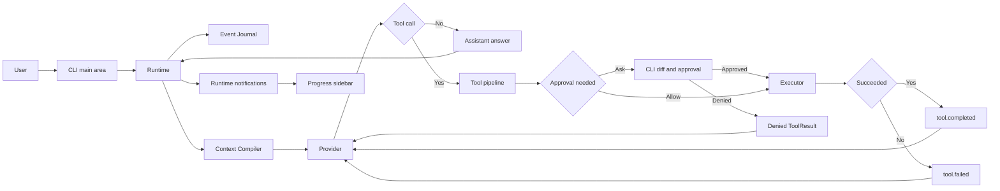
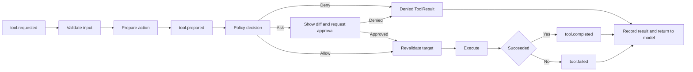
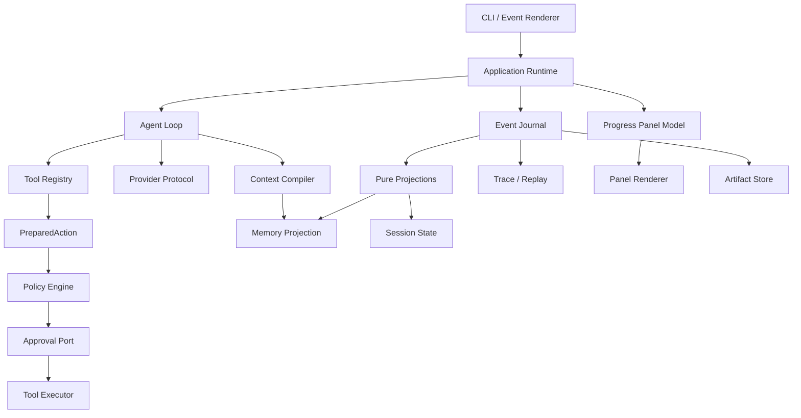

# MicroCode — 产品需求文档（PRD）

> 版本：v0.1 MVP
>
> 状态：已确认，作为实现基线
>
> 最后更新：2026-08-09
>
> 产品代号：MicroCode（正式公开发布前更名）
>
> 实现状态：项目架构骨架已建立；功能按 `plan.md` 的 M0–M12 逐步实现
>
> 配套实现教程：[`plan.md`](./plan.md)

## 1. 文档目的

本文档定义 MicroCode v0.1 MVP 要解决的问题、产品边界、核心创新、架构约束、功能需求和验收标准。

它回答“为什么做、做成什么样、哪些属于 MVP”，不承担逐文件的编码教学；具体实现顺序、代码骨架、测试方法和阶段验收见 `plan.md`。

本文档中的 `MUST` 表示 MVP 必须满足，`SHOULD` 表示强烈建议，`MAY` 表示可以延后。

## 2. 产品概述

### 2.1 一句话定义

**MicroCode 是一个可观察、可解释、可回放的轻量命令行 Code Agent。**

它以 Python 实现最小但完整的“理解需求 → 组织上下文 → 调用模型 → 使用工具 → 审批变更 → 记录结果”闭环，并把 Harness 的内部决策暴露给用户，而不只是显示模型最后说了什么。

### 2.2 产品定位

MicroCode 首先服务三个目标：

1. **自己真正使用**：能够在本地项目中完成代码问答、搜索、单文件修改和命令执行。
2. **开源学习项目**：代码结构足够清晰，读者能理解 Code Agent 的关键机制，而不是面对一个无法拆解的成品。
3. **Agent 方向面试项目**：能够具体展示事件溯源、上下文工程、工具安全、会话恢复、确定性测试和架构演进能力。

### 2.3 MVP 主题

MVP 的主题是 **Observable Agent Core（可观察的 Agent 核心）**。

MVP 不以“工具多”“支持模型多”为成功标准，而以以下三项差异化能力为成功标准：

1. **可观察、可回放的 Harness**：重要决策都形成持久事件；历史会话可以重建和播放。
2. **可解释的上下文编译**：用户能看到本轮给模型发送了什么，以及为什么选中或排除某项内容。
3. **有证据的自动记忆**：自动写入的记忆带来源、置信度、作用域和替代关系，不成为不可审计的“隐形知识”。

v0.1 以 **轻量进度侧栏（Progress Sidebar）** 呈现可观察性：它只显示当前 Turn 的关键阶段和状态，辅助用户理解 CLI 正在做什么。完整的因果执行树、历史图谱和动画系统留到 v0.2；两者都必须从事件派生，而不是成为另一份运行时事实。

### 2.4 它不是什么

| MicroCode v0.1 不是 | 说明 |
|---|---|
| Claude Code 或 Codex 的克隆 | 不追求功能数量和生态兼容性 |
| 单文件教学 Demo | 每个阶段可运行，但最终结构必须能继续演进 |
| 可视化优先的 TUI 平台 | MVP 以 CLI 主循环、输入、审批和错误恢复为重；右侧仅提供辅助性的轻量进度侧栏 |
| 自主运行平台 | 不做后台自治、团队和定时任务 |
| 通用工作流引擎 | 只解决 Code Agent 的核心闭环 |
| 多 Provider 聚合器 | MVP 只交付一个真实 Provider，第二个留到 v0.2 |

### 2.5 MVP 成功定义

MicroCode v0.1 的成功不是“已经像大型商业 Code Agent 一样功能齐全”，而是在一个可复现演示中同时证明以下能力：

| 维度 | 可观察结果 |
|---|---|
| 有用 | 能完成一次“读代码 → 修改一个文件 → 审批 → 运行测试 → 总结结果”的闭环 |
| 可观察 | 轻量进度侧栏显示当前阶段；`/trace` 能串起用户输入、上下文、模型、工具、策略、审批和结果 |
| 可解释 | `/context` 与 `/why` 能说明模型输入的组成、评分和排除原因 |
| 可回放 | `/replay` 可重建和播放历史，真实 Provider 与 Tool Executor 调用次数均为 0 |
| 安全 | 未批准前文件不变化；cwd 外写入和危险命令被拒绝；审批后的文件漂移会被检测 |
| 可演进 | ScriptedProvider、Golden Trace 和纯 Projection 让核心路径可离线测试和重构 |

架构骨架、文档和接口本身不等同于功能完成；只有第 12 节的全部验收标准通过，才可以宣布 v0.1 MVP 完成。

## 3. 参考项目与取舍

### 3.1 `learn-claude-code`

借鉴：

- Agent Loop、工具调用、权限、记忆、上下文压缩、任务与 MCP 等机制地图。
- “模型提供智能，Harness 提供环境、知识、行动能力和边界”的设计思想。
- 逐层构建、每层单独验证的学习方式。

不照搬：

- 单个 `code.py` 承担全部职责的教学结构。
- 全局可变状态、线程式后台任务和简化模拟实现。
- 为了展示机制而缺少的数据一致性、恢复和可测试边界。

### 3.2 `MiniCode`

借鉴：

- 结构化消息、工具注册器、权限审阅、JSONL 会话、上下文裁剪、Provider usage 和大输出落盘等工程经验。
- MCP、后台命令、Skills 等未来能力的接口启发。
- 对流式响应、工具结果和会话恢复边界情况的重视。

不照搬：

- 由超大 TUI 文件统筹会话、权限、上下文和渲染的高耦合结构。
- Agent Loop 同时拥有 Provider 恢复、上下文压缩和业务策略。
- JSON Schema 与运行时校验 schema 重复维护。
- 使用全局状态保存自动压缩状态。
- 用隐式 shell 字符串承载所有命令造成的跨平台和安全问题。

### 3.3 MicroCode 的差异

MicroCode 不只是重新排列两个参考项目的功能，而是从第一天把以下能力放进核心架构：

- Event Log 是唯一事实源，而不是 `messages[]` 或最终 session JSON。
- Context Compiler 是独立组件，而不是 Agent Loop 中的若干 `if`。
- Tool Effect Pipeline 把“模型想做什么”和“系统实际执行什么”分离。
- Replay 只读历史，不偷偷重新调用模型或执行工具。
- Memory Claim 必须携带证据和生命周期。

## 4. 目标用户与核心场景

### 4.1 目标用户

| 用户 | 主要需求 |
|---|---|
| 项目作者 | 从零掌握并实现一套能实际使用的 Code Agent Harness |
| Agent 学习者 | 沿着清晰模块学习 loop、event、context、tool、policy、memory |
| 开源贡献者 | 能替换 Provider、增加 ContextSource 或工具而不改核心循环 |
| 面试官/评审者 | 能通过命令、trace 和测试快速判断项目设计质量 |

### 4.2 核心使用场景

1. 用户在项目根目录启动 `microcode`，询问代码结构或实现细节。
2. Agent 搜索并读取项目文件，然后给出基于实际代码的回答。
3. 用户要求修改文件，Agent 生成单文件候选内容，系统显示 diff 并请求确认。
4. 用户批准后写入文件，再执行结构化测试命令并读取结果。
5. 用户通过 `/context` 和 `/why` 检查模型本轮看到了什么以及选择原因。
6. 用户退出后通过 `/resume` 恢复会话。
7. 用户通过 `/trace` 查看工具、权限、审批和模型调用时间线。
8. 用户通过 `/replay` 重新播放历史，但不产生任何外部副作用。
9. 用户通过 `/memory` 查看自动提取的偏好、项目事实和当前会话信息及其证据。
10. 用户通过右侧轻量进度侧栏看到当前处于 Context、Model、Tool、Approval 或 Memory 的哪个阶段；侧栏可展开、紧凑或折叠。

### 4.3 MVP 演示故事

发布演示必须能完成以下闭环：

```text
用户：读取 src 中与配置加载有关的代码，给配置增加一个 timeout 字段，然后运行相关测试。

MicroCode：
1. 编译上下文，并显示选中的项目说明与历史。
2. 模型调用 list_files/search_text/read_file。
3. edit_file 准备新内容，但尚未写盘。
4. Policy 判定为 ask，CLI 显示单文件 diff。
5. 用户批准，Executor 写入文件。
6. 模型调用 run_command(executable, args) 执行测试。
7. 所有关键动作写入 Event Log。
8. 右侧进度侧栏以简短状态显示 Context、Model、Tool、Approval 和 Memory 所处阶段。
9. `/trace` 可查看时间线，`/replay` 可无副作用播放。
10. `/why` 可解释某个文件或记忆为什么进入上下文。
```

### 4.4 MVP 用户闭环



主对话区始终是主要交互面；右侧进度侧栏只消费当前 Turn 的派生状态。关键业务变化由 Runtime 记录到 Event Journal，侧栏既不持有会话事实，也不反向触发模型、工具或权限决策。

## 5. 产品原则与系统不变量

以下原则比具体模块命名更重要，实现不得绕开：

### 5.1 Event Log 是唯一事实源

- 会话状态、消息、工具结果、审批、记忆变更都必须能够从事件重建。
- Projection/Snapshot 只是缓存，删除后必须能从 Event Log 重建。
- 不能只修改内存中的 `messages` 或某个 `session.json` 而不记录事件。
- 流式 token delta 可以只用于界面展示，不作为持久化事实；完整响应必须持久化。

### 5.2 意图与副作用分离

所有可能产生副作用的工具必须经过：

```text
validate → prepare → policy → approval → execute → record
```

模型提出的是 `ToolRequest`，不是直接执行权限。`PreparedAction` 包含规范化后的目标、预览、风险和将要执行的操作。

#### 5.2.1 副作用处理流程



所有分支都必须留下可追溯的事件；“拒绝”是结构化工具结果，而不是把 Python 异常直接暴露给模型。

### 5.3 Replay 永不产生副作用

MVP 中 Replay 只支持：

- 从事件恢复某一时刻的会话状态。
- 按原始顺序播放已有的模型、工具、权限和审批事件。

Replay **不得**：

- 重新调用模型。
- 重新执行命令。
- 再次写文件。
- 重新提取或写入记忆。

以后如果增加“重新运行”能力，必须使用不同名称，例如 `rerun`，且重新走权限流程。

### 5.4 上下文必须可解释

每次模型请求都要产生 `ContextSnapshot`，记录：

- 候选项来自哪里。
- 每项估算 token 数。
- 确定性评分与评分因素。
- 最终是否选中。
- 未选中的原因，例如预算不足、重复、过期或作用域不匹配。
- 最终发送内容的摘要或 Artifact 引用。

### 5.5 记忆必须有证据

自动记忆不得只有一句无来源文本。每个 `MemoryClaim` 必须包含 evidence event IDs、confidence、scope、status 和时间信息。冲突更新使用 `supersedes`，不覆盖旧记录。

### 5.6 安全默认与本地优先

- 生成状态默认只保存在本机 `~/.microcode`。
- 项目目录只保存用户明确共享的配置和说明。
- cwd 外写入默认拒绝。
- 单文件变更必须先显示 diff，再请求批准。
- 命令优先使用 `executable + args`，避免隐式 shell 解析。

### 5.7 轻量可视化是派生展示，不是新的状态源

- 进度侧栏只读取 Runtime Notification 和 Event Log Projection，不直接驱动模型、工具或权限决策。
- MVP 只展示当前 Turn 的阶段顺序、当前状态、简短结果和等待原因，不构建完整的因果节点图。
- 颜色、spinner、终端尺寸和未来动画帧不写入 Event Log，也不改变 Replay 结果。
- 侧栏宽度、显示密度和折叠状态属于本地 UI 偏好，可保存在 `settings.json`。
- 进程中断后，尚未得到终态事件的当前阶段必须显示为 `interrupted`，不得伪装成成功或继续运行。

## 6. MVP 功能范围

### 6.0 范围冻结原则

第 6 节定义的是 v0.1 的完整交付边界。实现过程中出现的新模型、工具、UI 或自治能力，除非直接修复已列出的验收标准，否则一律记录到后续版本路线图，不得挤占当前闭环的完成质量。

每次范围变更必须同时更新：本 PRD 的功能范围与路线图、`plan.md` 的里程碑，以及自动生成的 `infrastructure.md`。

### 6.1 Event Kernel

MVP MUST：

- 定义版本化 `EventEnvelope`。
- 按 stream 追加写 JSONL，支持 optimistic expected-version 检查。
- 写入时加进程锁，`flush` 后 `fsync`。
- 支持 session stream、user memory stream 和 project memory stream。
- 使用纯函数 Projection 从事件重建状态。
- 支持可删除、可重建的 Snapshot。
- 使用 SHA-256 Artifact Store 保存大文本、完整工具输出和 Provider 原生块。
- 对损坏的 JSONL 尾行给出明确诊断，不静默吞掉。

MVP 持久事件至少包括：

| 类别 | 事件示例 |
|---|---|
| Session | `session.started`, `session.resumed`, `session.provider_pinned` |
| Turn | `turn.started`, `user.message_recorded`, `turn.completed`, `turn.failed` |
| Context | `context.compiled` |
| Model | `model.requested`, `model.response_completed`, `model.failed` |
| Tool | `tool.requested`, `tool.prepared`, `tool.completed`, `tool.failed` |
| Policy | `policy.decided`, `approval.requested`, `approval.decided` |
| Assistant | `assistant.message_recorded` |
| Memory | `memory.extraction_requested`, `memory.extraction_completed`, `memory.extraction_failed`, `memory.proposed`, `memory.accepted`, `memory.rejected`, `memory.superseded` |

以下内容不单独持久化为事件：每个 text token delta、spinner 更新、颜色和光标状态。

### 6.2 Session、Trace 与 Replay

MVP MUST：

- 新建会话时固定 `project_root`、Provider、model 和 Context Compiler 配置。
- 支持列出、恢复和继续会话。
- 从 Event Log 重建对话历史和工作状态。
- `/trace` 以时间线展示关键事件，可按当前 turn 或整个 session 查看。
- `/replay` 支持 normal 和 step 两种播放方式。
- Replay 模式使用只读 Event Store，不构造真实 Provider 或 Tool Executor。

MVP 不要求基于历史任意分叉；`fork` 留到 v0.2。

### 6.3 Context Compiler

MVP 的 Context Compiler 接收 `ContextCandidate`，经过规范化、去重、确定性评分和预算装箱，输出不可变 `ContextSnapshot`。

MVP ContextSource：

1. 基础 system instructions。
2. 当前用户输入。
3. 最近会话消息。
4. 项目说明：从 project root 到 cwd 分层读取 `MICRO.md` 与 `AGENTS.md`。
5. 最近工具结果与 Working Set 文件。
6. 用户、项目、会话三层 Memory Claim。
7. 用户消息中显式提及的文件。

确定性评分至少考虑：

- source priority。
- 是否被当前请求显式引用。
- 与当前请求的词项重合度。
- 新近度。
- 作用域是否匹配。
- 内容大小惩罚。

MVP 使用近似 token 估算，并采用保守的默认 context budget。预算配置包含模型输入上限、输出预留、工具结果预留和安全余量。不得把 Provider 宣称的最大窗口全部用满。

MVP 不使用模型 rerank；模型重排留到 v0.2。确定性选择使测试、`/why` 和回归对比更可靠。

### 6.4 Provider 与 Agent Loop

MVP MUST 提供：

- 一个 Provider Protocol，Agent Loop 不引用厂商 SDK 类型。
- `ScriptedProvider`：按脚本返回文本或工具调用，用于单元测试和公开示例。
- 一个真实 `AnthropicProvider`：使用 Anthropic Messages 协议，并允许通过 `ANTHROPIC_BASE_URL` 连接兼容端点；首个验证目标是当前工作区已经使用的 Kimi Anthropic 兼容端点。
- 流式文本展示。
- 有界 Agent Loop，默认最多 20 次模型迭代和 10 次工具调用；达到上限形成失败事件。
- 超时、限流和可重试服务错误的有限指数退避。
- Provider 原生内容块的顺序、tool-use ID、thinking/signature 等不可移植信息保存为 Artifact，避免适配层丢信息。

Provider 与 model 在 session 创建时固定。MVP 不允许同一个 session 中途换 Provider，因为不同协议的内容块、工具 ID 和 reasoning artifact 未必可互换。

第二个真实 Provider（OpenAI Responses API）留到 v0.2。届时应由本地事件和投影管理历史，并默认采用不依赖 Provider 服务端会话状态的请求方式。

### 6.5 工具与 Tool Effect Pipeline

MVP 工具集：

| 工具 | 作用 | 默认策略 |
|---|---|---|
| `list_files` | 列目录/匹配文件，结果稳定排序 | cwd 内允许 |
| `search_text` | 基于 `rg` 搜索文本并限制结果大小 | cwd 内允许 |
| `read_file` | 分段读取文本文件 | cwd 内允许 |
| `edit_file` | 精确替换并准备单文件 diff | 必须审批 |
| `write_file` | 新建或完整替换文件并准备 diff | 必须审批 |
| `run_command` | 使用结构化 `executable + args` 执行命令 | allow/ask/deny |
| `ask_user` | 在缺少关键选择时请求用户输入 | 允许 |

工具输出超过阈值时，事件中只保存摘要和 ArtifactRef，完整内容写 Artifact Store。

早期讨论过同时提供显式 `run_shell(command)`。为缩小 MVP，v0.1 只交付结构化 `run_command`；`run_shell` 延后到 v0.2，且必须显示完整 shell 字符串并使用更严格的审批策略。

### 6.6 单文件 PreparedAction 与 Diff 审批

MVP 只支持一次工具调用创建或修改一个文件：

- `edit_file` 的替换必须精确匹配；0 次或多次匹配都失败，不猜测。
- `write_file` 可以 create 或 modify。
- 不支持 delete 和 rename。
- Prepare 阶段在内存中计算 `before`、`after`、digest 和 unified diff。
- 批准前不得落盘。
- Execute 前重新校验原文件 digest，防止审批后文件已被外部修改。
- 写入使用同目录临时文件 + 原子替换；失败形成事件。

完整的多文件 `ChangeSet` 设计保留到 v0.3，范围仍为 create + content modification；delete/rename 再单独评估。MVP 的 `PreparedAction` 必须能自然演进为 `ChangeSet`，不能把审批写死在工具 handler 内。

### 6.7 Permission Policy

MVP 采用 balanced default：

- cwd 内读取：allow。
- cwd 外读取：ask 或 deny，由敏感路径规则决定。
- cwd 内创建/修改：ask，并显示 diff。
- cwd 外创建/修改：deny。
- 已知低风险结构化命令：allow，例如 `git status`、`git diff`、`rg`。
- 会修改项目或环境但通常可恢复的命令：ask，例如测试、格式化、安装依赖。
- 高风险命令或参数：deny，例如破坏性递归删除、强制推送和明显越界目标。
- 未匹配规则：ask，不静默允许。

Policy MUST 使用规范化绝对路径检查 cwd 包含关系，并考虑 `..` 与 symlink 逃逸。规则判定结果必须带 `rule_id` 和 reason 写入事件。

### 6.8 自动记忆

MVP 保留三层作用域：

| Scope | 示例 | 生命周期 |
|---|---|---|
| `user` | 用户稳定偏好，例如“代码注释用英文” | 跨项目 |
| `project` | 项目事实，例如“测试入口是 pytest” | 跨会话、限当前项目 |
| `session` | 当前任务约束，例如“本轮不修改数据库层” | 当前会话 |

每个 `MemoryClaim` 至少包含：

- `memory_id`
- `scope`
- `kind`
- `claim`
- `confidence`
- `evidence_event_ids`
- `created_at`
- `status`: `active | rejected | superseded`
- `supersedes`（可空）

MVP 策略：

- 首次运行明确请求用户同意自动长期记忆；不同意时仍可使用 session memory，但不得写 user/project memory。
- 每个成功 turn 后同步执行一次提取，完成后再返回稳定提示符。
- 允许模型辅助生成结构化候选，但必须通过 schema、作用域、证据存在性、敏感信息和置信度规则校验。
- 符合阈值的候选自动接受并写事件，做到“自动写但可追踪”。
- Context Compiler 使用确定性规则检索和排序记忆，不做模型 rerank。
- `/memory` 能查看证据、拒绝或遗忘某条记忆；遗忘通过新事件表达，不物理篡改历史。

异步持久任务、重试队列和模型 rerank 留到 v0.2。

### 6.9 CLI 优先与轻量进度侧栏

MVP 使用英文命令和英文运行时文案，文档提供英文主 README 与中文 README。当前 PRD/Plan 使用中文讲解，代码标识符保持英文。

CLI 主循环、用户输入、流式回答、工具提示、审批、错误恢复和 session resume 是 v0.1 的 UI 优先级。右侧进度侧栏只辅助回答“现在进行到哪一步”，不替代对话区，也不承担完整 Trace 浏览器职责：

```text
┌───────────────────────────────────────┬──────────────────────────────┐
│ Conversation / command                 │ Progress                     │
│ User request and assistant transcript  │ ✓ Context compiled           │
│ > _                                    │ ◐ Model is responding        │
│                                        │ ○ Awaiting next tool         │
└───────────────────────────────────────┴──────────────────────────────┘
```

右侧侧栏 MUST 支持三种模式：

| 模式 | 行为 |
|---|---|
| `expanded` | 显示当前 Turn 的阶段列表、状态、简短结果和等待原因 |
| `compact` | 仅显示当前阶段、计数和最终结果，适合较窄终端 |
| `collapsed` | 隐藏侧栏，主对话区占满宽度；`/progress` 仍可输出文字摘要 |

当终端宽度不足以同时保留可读的主对话区和侧栏时，系统 MUST 自动切到 `collapsed` 或底部摘要模式，不能压缩输入区到不可用。MVP 不要求鼠标拖拽、缩放、节点展开、历史图谱或复杂动画。

阶段至少使用 `pending`、`running`、`awaiting_approval`、`completed`、`failed`、`cancelled` 和 `interrupted` 状态。图标、颜色和 spinner 只是表现细节，不得改变状态语义。

界面实现保持最小、可替换的边界：

```text
Runtime Notification / Event Projection → ProgressPanelModel → Panel Renderer
```

- `ProgressPanelModel` 只保存当前 Turn 的阶段顺序、状态、摘要和必要计数；它不是完整因果图。
- Panel Renderer 管理侧栏的显示密度和折叠逻辑；未来替换终端 UI 库或增加动画时，不改 Event Schema、Agent Loop 或 Tool Pipeline。
- `prompt_toolkit` SHOULD 负责异步输入、快捷键和基本布局；Rich 可以渲染静态表格、diff 与提示，但不得持有 UI 业务状态。

必需命令：

| 命令 | 行为 |
|---|---|
| `/help` | 显示命令帮助 |
| `/status` | 显示 session、Provider、model、project root 和预算 |
| `/tools` | 显示工具及默认权限级别 |
| `/sessions` | 列出本项目会话 |
| `/resume <id>` | 恢复指定会话 |
| `/context` | 显示最近 ContextSnapshot 的组成与预算 |
| `/why <candidate-or-path>` | 解释上下文选中/排除原因 |
| `/progress [current|turn-id]` | 输出当前或指定 turn 的轻量阶段摘要 |
| `/trace [turn|session]` | 显示事件时间线 |
| `/replay [--step]` | 无副作用播放当前会话 |
| `/memory [list|show|forget|consent]` | 管理可追溯记忆与长期记忆同意 |
| `/exit` | 安全退出 |

### 6.10 本地存储与项目文件

所有生成状态默认放在：

```text
~/.microcode/
├── events/
│   ├── sessions/<session-id>.jsonl
│   └── memory/
│       ├── user.jsonl
│       └── projects/<project-id>.jsonl
├── artifacts/sha256/<prefix>/<digest>
├── snapshots/
├── locks/
└── settings.json
```

`settings.json` 只保存本地 UI 偏好和非领域默认值，不保存会话、审批或记忆的最终状态；长期记忆 consent 仍通过事件表达。

仓库中只允许出现用户可以共享和评审的文件：

```text
<project>/
├── MICRO.md
├── AGENTS.md
└── .microcode/config.toml   # 可选，项目级策略与预算配置
```

不得在被操作的项目中自动生成 session、memory、trace 或临时输出目录。

### 6.11 测试与 Eval

MVP MUST：

- 使用 `pytest`、`pytest-asyncio`。
- 核心代码通过 Ruff 和 mypy。
- 使用临时目录测试，不能污染真实 `~/.microcode`。
- 使用 `ScriptedProvider` 覆盖纯文本、单工具、多工具、拒绝、错误和上限场景。
- 使用 golden trace 验证关键场景的事件类型、因果关系和投影结果。
- 证明 Replay 时 Provider 调用次数和 Tool 执行次数均为 0。
- 证明 Snapshot 删除后重建结果一致。
- 真实 Provider 测试默认标记为 integration，不进入离线单测。

公开 Trace Eval CLI 与脱敏导出留到 v0.2；MVP 先把 trace schema、fixture 和 golden tests 做成可公开评审的基础。

## 7. 核心数据模型

### 7.1 EventEnvelope

逻辑字段：

```python
class EventEnvelope:
    schema_version: int
    event_id: str
    stream_id: str
    stream_version: int
    occurred_at: datetime
    event_type: str
    session_id: str | None
    run_id: str | None
    turn_id: str | None
    causation_id: str | None
    correlation_id: str | None
    payload: dict[str, object]
```

- `stream_version` 在同一 stream 内从 1 单调递增。
- `causation_id` 指向直接导致当前事件的事件。
- `correlation_id` 串联同一 turn 或同一动作链。
- `schema_version` 用于将来的事件迁移，不能依靠“当前代码刚好读得懂”。

### 7.2 ContextCandidate 与 ContextSnapshot

```python
class ContextCandidate:
    candidate_id: str
    source: str
    scope: str
    content_ref: str
    estimated_tokens: int
    score: float
    score_factors: dict[str, float]
    metadata: dict[str, object]

class ContextDecision:
    candidate_id: str
    included: bool
    reason: str
    final_position: int | None

class ContextSnapshot:
    snapshot_id: str
    budget: dict[str, int]
    candidates: list[ContextCandidate]
    decisions: list[ContextDecision]
    rendered_context_ref: str
    rendered_digest: str
```

### 7.3 Provider 语义对象

核心层使用可移植语义块，例如 `TextBlock`、`ToolUseBlock`、`ToolResultBlock`。适配器还必须保存有顺序的 Provider 原生事件/内容块 Artifact，以免 reasoning、signature 或未来协议字段被过早抹平。

### 7.4 PreparedAction

```python
class PreparedAction:
    action_id: str
    tool_call_id: str
    effect: str
    normalized_target: str | None
    preview_ref: str | None
    before_digest: str | None
    risk: str
    executable: dict[str, object]
```

`PreparedAction` 是 Policy 与 Executor 的共同输入，也是以后组合多文件 ChangeSet 的最小单元。

### 7.5 ProgressPanelModel 与 UI 状态

```python
class ProgressStep:
    stage: str
    status: str
    label: str
    summary: str
    event_id: str | None

class ProgressPanelModel:
    turn_id: str
    steps: list[ProgressStep]

class ProgressViewState:
    panel_mode: str       # expanded | compact | collapsed
    panel_width: int
    selected_node_id: str | None
```

`ProgressPanelModel` 由 Runtime Notification 和 Event Log 派生，属于当前 Turn 的轻量展示视图；`ProgressViewState` 只属于本地 UI 偏好。MVP 不实现动画，但 Renderer 必须只依赖稳定的 Model，因此未来增加动画帧时不影响业务状态。完整 `ExecutionGraph` 留到 v0.2。

## 8. 系统架构

### 8.1 模块关系



### 8.2 依赖规则

- `domain` 不引用 CLI、SDK 或文件系统实现。
- `agent` 只依赖 Protocol 和领域类型，不依赖 Anthropic SDK。
- `tools` 不能直接向 CLI 提问；通过 `ApprovalPort`/`UserInputPort`。
- `cli` 负责输入输出、分栏布局和本地 UI 偏好，不直接修改 session state。
- 所有持久状态变更由 Application Service 先形成事件，再由 Projection 更新视图。
- Projection 必须是给定旧状态和事件即可得到新状态的纯函数。
- ProgressPanelModel 是轻量派生视图；UI Renderer 不得反向写入事件、权限或工具状态。
- 动画策略属于 v0.2 的表现层能力，只能解释稳定 Model 的状态变化，不能创建新的业务状态。

### 8.3 Python 目标目录

```text
MicroCode/
├── AGENTS.md
├── .githooks/
│   └── pre-commit
├── scripts/
│   ├── install_git_hooks.py
│   └── update_infrastructure.py
├── pyproject.toml
├── README.md
├── README.zh-CN.md
├── LICENSE
├── src/microcode/
│   ├── __init__.py
│   ├── __main__.py
│   ├── config.py
│   ├── runtime.py
│   ├── domain/
│   ├── eventlog/
│   ├── session/
│   ├── provider/
│   ├── context/
│   ├── agent/
│   ├── tools/
│   ├── policy/
│   ├── actions/
│   ├── memory/
│   └── cli/
├── tests/
│   ├── unit/
│   ├── integration/
│   ├── golden/
│   └── fixtures/
└── doc/
    ├── infrastructure.md
    ├── prd.md
    └── plan.md
```

`doc/infrastructure.md` 是从当前项目树和模块 docstring 自动生成的架构说明；它提供逐文件职责，不替代本 PRD 的产品边界。项目根目录的 `AGENTS.md` 要求每次开发改动后重新生成并检查该文档。

## 9. 非功能需求

| 维度 | MVP 要求 |
|---|---|
| 语言 | Python 3.11+；开发机当前为 Python 3.12 |
| 并发模型 | asyncio-first，不在线程中隐藏核心流程 |
| 依赖策略 | 轻量实用：Pydantic、Anthropic SDK、Rich、prompt_toolkit、filelock |
| 包管理 | 标准 `pyproject.toml` + `venv` + `pip` |
| 类型 | 公开接口必须有类型标注；mypy 检查核心包 |
| 格式与静态检查 | Ruff format/check |
| 文件大小 | 单文件 SHOULD 小于 400 行；超过时优先按职责拆分 |
| 平台 | Windows 为首个开发平台，设计上兼容 macOS/Linux |
| 性能 | 本地事件追加 p95 < 20ms；普通 Projection 重建 1,000 事件 < 1s |
| 可靠性 | 进程中断后最多留下可诊断的尾部半行，不得产生静默错误状态 |
| 可测试性 | 核心测试不访问网络、不依赖真实 home、不执行危险命令 |
| 可移植性 | OS 命令使用结构化 argv；路径统一经 `pathlib.Path.resolve()` |
| 可观测性 | 每个模型请求、工具动作、权限决策有 correlation/causation 链 |
| 终端 UI | CLI 主流程优先；宽屏提供轻量进度侧栏，窄屏自动降级，核心输入与审批始终可用 |

## 10. 隐私与安全

### 10.1 本地默认

- Trace、Memory、Artifacts 和 Snapshot 默认仅存在用户本机。
- MVP 不上传遥测，不提供云同步。
- API 请求只包含 ContextSnapshot 最终选中的内容。

### 10.2 记忆同意

首次运行必须明确说明：

- 什么内容可能被记住。
- 写到哪里。
- 如何查看与遗忘。
- 不同意不会阻止基础 Agent 功能。

### 10.3 Secret 处理

- API key 只从环境变量或用户级设置读取，不写 Event Log。
- `.env`、私钥、token 等路径默认降低 Context 候选优先级或直接排除。
- 工具输出和记忆提取前使用基础 secret pattern 检测；命中时不进入长期记忆。

### 10.4 Trace 导出

MVP 只支持本地查看，不承诺可以安全公开。带规则脱敏和可审计报告的 trace export 在 v0.2 实现。

## 11. 错误处理与恢复

| 失败 | 行为 |
|---|---|
| Provider 超时/429/5xx | 有界重试，记录 attempt；耗尽后 `model.failed` |
| Provider 输出未知工具 | 形成失败 tool result 返回模型，不崩溃 |
| 工具参数 schema 失败 | `tool.failed`，不进入 prepare/execute |
| 用户拒绝审批 | `approval.decided(deny)`，返回结构化拒绝结果给模型 |
| 文件审批后被外部修改 | digest 冲突，拒绝写入并要求模型重新读取 |
| 命令超时 | 终止子进程，保存部分输出 Artifact，形成失败事件 |
| Event Log 尾行损坏 | 停止自动恢复，报告文件与偏移；提供只读诊断 |
| Projection Snapshot 损坏 | 删除缓存并从 Event Log 重建 |
| Ctrl-C | 第一次取消当前 turn，记录取消；空闲时再次退出 |

## 12. MVP 验收标准

以下项目必须全部通过：

### 12.1 用户能力

- [ ] 能启动交互 CLI，完成多轮问答。
- [ ] 能搜索、列出、分段读取 cwd 内文件。
- [ ] 能准备单文件 create/modify diff；未批准前文件不变化。
- [ ] 批准后能原子写入；原文件 digest 变化时拒绝写入。
- [ ] 能用结构化 argv 运行一个被允许或批准的命令。
- [ ] 能恢复已有 session 并继续对话。

### 12.2 可观察性

- [ ] 每轮都有 `ContextSnapshot`。
- [ ] `/context` 显示预算、来源、选中和排除项。
- [ ] `/why` 能解释至少项目说明、working-set 文件和 memory 的决策。
- [ ] `/trace` 能串起 user → context → model → tool → policy → result → assistant。
- [ ] 宽屏终端中，轻量进度侧栏能实时显示当前 turn 的阶段、状态和摘要。
- [ ] 侧栏可在 `expanded`、`compact`、`collapsed` 间切换；窄屏降级不会阻塞输入或审批。
- [ ] `/progress` 能在侧栏折叠时输出当前 turn 的文字阶段摘要。
- [ ] 大输出通过 ArtifactRef 查阅，不破坏 JSONL 可读性。

### 12.3 回放与一致性

- [ ] 删除 Snapshot 后可由 Event Log 重建相同 session state。
- [ ] `/replay` 支持完整播放和逐步播放。
- [ ] Replay 的真实 Provider 调用次数为 0。
- [ ] Replay 的 Tool Executor 调用次数为 0。
- [ ] 同一 golden event stream 产生稳定一致的 Projection。
- [ ] 未完成的当前阶段在重建后显示为 `interrupted`，而不是 `completed` 或 `running`。

### 12.4 记忆

- [ ] 首次运行询问长期记忆同意。
- [ ] 成功 turn 后同步提取候选记忆。
- [ ] user/project/session 三种 scope 可工作。
- [ ] 每条 accepted memory 可显示 evidence、confidence 和状态。
- [ ] 新事实可通过 `supersedes` 替代旧事实，旧事件仍保留。
- [ ] `/memory forget` 使用事件撤销有效状态，而不是篡改历史。

### 12.5 安全与质量

- [ ] cwd 外写入默认拒绝。
- [ ] 路径 `..` 和 symlink 逃逸测试通过。
- [ ] 危险命令策略测试通过。
- [ ] 所有单元测试离线通过。
- [ ] Ruff 和 mypy 通过。
- [ ] Windows 完成端到端演示；跨平台路径和 argv 单测通过。
- [ ] README 与 README.zh-CN.md 能让新用户在 10 分钟内启动第一个会话。

### 12.6 文档与开发治理

- [ ] PRD、Plan、README 与实际目录结构没有相互矛盾的技术栈、工具范围或版本边界。
- [ ] `python scripts/update_infrastructure.py --check` 通过，架构文档与当前文件树一致。
- [ ] 项目中的 Python 模块都有简洁准确的顶部 docstring，使新增文件能自动获得职责说明。
- [ ] 自动生成文档、测试 fixture 和 Event Log 中不包含 API key、密码或其他敏感信息。

## 13. 版本路线图

### v0.1 — Observable Agent Core

- Event Source、Projection、Snapshot、Artifact。
- Context Compiler、`/context`、`/why`。
- ScriptedProvider + 一个 Anthropic Messages 真实 Provider。
- 七个基础工具、PreparedAction、balanced permission、单文件 diff。
- 三层有证据记忆，同步提取。
- CLI 主循环、可折叠轻量进度侧栏、session resume、trace、无副作用 replay。
- Golden trace tests。

### v0.2 — Compatibility and Evaluation

- OpenAI Responses Provider。
- 显式 `run_shell` 与更严格审批。
- 模型 rerank 记忆/上下文。
- 异步持久 Memory Job 与失败恢复。
- Session fork。
- 脱敏 Trace Export。
- Public Trace Eval CLI。
- 更完善的上下文 compact 策略。
- 可配置主题、动画策略、节点筛选、完整因果执行树和更丰富的执行图交互。

### v0.3 — Transactional Actions and Extensions

- 多文件 ChangeSet（create + modify）与事务式提交/补偿恢复。
- Hooks。
- Skills。
- MCP。
- Background command jobs。

### v0.4+

- Subagents、Task System、Worktree isolation。
- 更完整的安全沙箱。
- 可选 TUI。
- Teams、Scheduler 等能力只在真实需求出现后评估。

## 14. 已确认的产品决策

| 决策 | 结果 |
|---|---|
| 产品目标 | 自用 + 开源 + Agent 面试项目 |
| MVP 创新主轴 | 可观察/可回放 Harness + 上下文智能 |
| UI | CLI 主流程优先；宽屏显示主对话区 + 轻量进度侧栏，不做重型通用 TUI 平台 |
| 执行可视化 | MVP 只显示当前 Turn 的轻量阶段进度；完整因果执行树与动画留到 v0.2 |
| 事实源 | Event Log 是唯一事实源 |
| Replay | 状态重建 + 时间线播放；绝不重新调用模型/工具 |
| Context selection | MVP 确定性评分；模型 rerank 延后 |
| Memory | 自动写、可追溯、带证据/置信度/supersession |
| Memory scope | user + project + session |
| Memory extraction | MVP 每轮后同步；持久异步任务延后 |
| 长期记忆同意 | 首次运行明确征求 |
| Provider | MVP 一个真实 Provider + ScriptedProvider；双 Provider 延后 |
| Session Provider | Provider 和 model 固定 |
| 命令 | MVP 结构化 executable+args；显式 shell 延后 |
| 文件改动 | MVP 单文件 PreparedAction；多文件 ChangeSet 延后 |
| ChangeSet 初始范围 | create + content modification，不含 delete/rename |
| Permission | balanced default |
| 项目说明 | `MICRO.md` + `AGENTS.md` |
| Generated state | `~/.microcode`；仓库仅共享说明与配置 |
| Trace privacy | 本地默认；脱敏导出延后 |
| Eval | MVP golden trace；公开 eval CLI 延后 |
| 语言 | Python 3.11+、asyncio-first |
| 依赖 | 实用轻依赖，不追求零依赖 |
| 包管理 | `pyproject.toml` + `venv` + `pip` |
| 产品语言 | 英文代码/CLI，双语文档 |
| 名称 | MicroCode 为代号，公开发布前更名 |
| License | MIT |

## 15. 术语表

| 术语 | 定义 |
|---|---|
| Harness | 围绕模型提供上下文、工具、权限、执行、恢复和观测的系统 |
| Event Source | 用不可变事件而非最终状态作为事实源 |
| Projection | 将事件序列折叠为当前状态的纯函数/视图 |
| Snapshot | Projection 的可重建缓存，不是事实源 |
| Artifact | 以内容摘要寻址的大文本或二进制数据 |
| Context Compiler | 收集、评分、装箱并解释模型输入的组件 |
| PreparedAction | 已验证、可预览、尚未执行的副作用动作 |
| Memory Claim | 带证据、置信度、作用域和状态的记忆陈述 |
| Trace | 一次 session/turn 的因果事件时间线 |
| Replay | 不产生副作用地重建并播放既有历史 |
| Progress Panel | 显示当前 Turn 阶段、状态和摘要的轻量侧栏，由事件和运行时通知派生 |
| Execution Graph | 从事件因果关系投影出的 Turn 执行树；作为 v0.2 的增强可视化能力 |
| Animation Policy | 将稳定 ViewModel 状态变化转为视觉过渡的 Renderer 策略；v0.2 才实现，不属于持久业务状态 |

## 16. 参考资料

- `D:\vscode\projects\codeDemo\learn-claude-code`：机制学习参考。
- `D:\vscode\projects\codeDemo\MiniCode`：工程实现参考。
- `D:\vscode\projects\codeDemo\MicroCode\doc\plan.md`：MVP 逐步实现教程。
- `D:\vscode\projects\codeDemo\MicroCode\doc\infrastructure.md`：自动生成的项目文件架构与职责说明。
- Anthropic Messages / Tool Use / Streaming 官方文档：实现 Provider 时以当前官方协议为准。
- OpenAI Responses / Function Calling / Streaming 官方文档：v0.2 实现第二 Provider 时使用。
